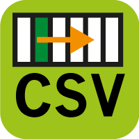

layout: guide
title: CSV files - What is a CSV file and how do I save my spreadsheet as one? 
keywords: batch xls to csv, batch xls to csv converter, batch csv file, batch csv editor, batch convert xlsx to csv, batch create csv file, batch csv excel
description: Is it possible to convert  Excel files to CSV in batch? To achieve the expected result, users sometimes require specialized software. 
---

 
## What is CSV file?
A CSV is a comma separated values file which allows data to be saved in a table structured format. CSVs look like a garden-variety spreadsheet but with a .csv extension. Traditionally they take the form of a text file containing information separated by commas, hence the name.

CSV files can be used with any spreadsheet program, such as Microsoft Excel, Open Office Calc, or Google Spreadsheets. They differ from other spreadsheet file types in that you can only have a single sheet in a file, they can not save cell, column, or row styling, and can not save formulas.
 

## Saving Your Spreadsheet as a CSV.

**Step 1**: Import your Excel file or a batch of files into this converter by clicking.

 
**Step 2**: Set your output directory to put your output in the right file.

 
**Step 3**: If you want to preview the convert effects, you can see it clearly 

 
**Step 4**: In the Preview interface, there are "Sheet" and "Others" options for you, here is the sheet select setting:

 
**Step 5**: Clicking "others", you can easily find the coding set, then you can feel free to choose UTF-8 or UTF-16, or any other codings here. 

 
**Step 6**: The final step is to click the convert button, you can choose to convert one file at once or convert all files at one go.

 
Hopefully the above has given you an insight into the wonderful world of XLS2csv. Now download it and give it a try.

 
Also read
<a href="https://gmagon.com/guide/mac-batch-convert-xls-to-csv.html" target="_blank" rel="nofollow me noopener noreferrer" >Mac batch convert XLS to CSV</a>
<a href="https://gmagon.com/guide/how-to-convert-a-xlsx-file-to-csv-on-mac.html" target="_blank" rel="nofollow me noopener noreferrer" >How to convert a .xlsx file to .csv on Mac?</a>
<a href="https://gmagon.com/guide/create-border-radius-css-mac.html" target="_blank" rel="nofollow me noopener noreferrer" >How to create border radius CSS code on Mac?</a>
<a href="https://gmagon.com/guide/convert-xls-on-mac-without-excel.html" target="_blank" rel="nofollow me noopener noreferrer" >Convert XLS to CSV on Mac without Excel installed</a>
<a href="https://gmagon.com/guide/can-i-batch-convert-xls-to-csv-mac.html" target="_blank" rel="nofollow me noopener noreferrer" >Can I batch convert XLS/XLSX to CSV in Mac?</a>

