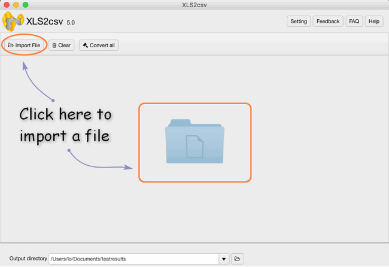

layout: guide
title: CSV-Separator - Determine the field separator of a CSV file.   
keywords: csv separator excel, csv separator delimiter, csv separator character, csv delimiter and separator, csv separator options, csv separator semicolon
description: How to get Excel files to interpret the separator in CSV files? 
---

This article aims to explain how to separate Excel files with delimiters in CSV files. It provides a fast detection of a character separated text file, and returns it ready to use in a CSV parser. This may be useful to the vulnerable -and often ignored- population of programmers who need to process automatically CSV files from different sources. 

The default set of candidates contains the following characters: "," "." "tab" "space"

The only required parameter is the CSV file path. Optionally, the user can specify characters to be excluded or included in the list of candidates.

 
### How to get Excel files to interpret the separator in CSV files?
Fortunately, I have found the <a href="https://gmagon.com/products/store/xls2csv/" target="_blank" rel="nofollow me noopener noreferrer" >XLS2csv</a>, which aims to convert XLS/XLSX files to CSV format, you can choose the any separator as you want. 
 
**Step 1**: Import your Excel file or a batch of files into this converter by clicking.

 
**Step 2**: Set your output directory to put your output in the right file.

 
**Step 3**: If you want to preview the convert effects, you can see it clearly 

 
**Step 4**: In the Preview interface, there are "Sheet" and "Others" options for you, here is the sheet select setting:

 
**Step 5**: Clicking "Separator", you can easily find the separator, then you can feel free to choose  here. 

 
**Step 6**: The final step is to click the convert button, you can choose to convert one file at once or convert all files at one go.

 
Hopefully the above has given you an insight into the wonderful world of XLS2csv. Now download it and give it a try.

 
Also read
<a href="https://gmagon.com/guide/mac-batch-convert-xls-to-csv.html" target="_blank" rel="nofollow me noopener noreferrer" >Mac batch convert XLS to CSV</a>
<a href="https://gmagon.com/guide/how-to-convert-a-xlsx-file-to-csv-on-mac.html" target="_blank" rel="nofollow me noopener noreferrer" >How to convert a .xlsx file to .csv on Mac?</a>
<a href="https://gmagon.com/guide/create-border-radius-css-mac.html" target="_blank" rel="nofollow me noopener noreferrer" >How to create border radius CSS code on Mac?</a>
<a href="https://gmagon.com/guide/convert-xls-on-mac-without-excel.html" target="_blank" rel="nofollow me noopener noreferrer" >Convert XLS to CSV on Mac without Excel installed</a>
<a href="https://gmagon.com/guide/can-i-batch-convert-xls-to-csv-mac.html" target="_blank" rel="nofollow me noopener noreferrer" >Can I batch convert XLS/XLSX to CSV in Mac?</a>

