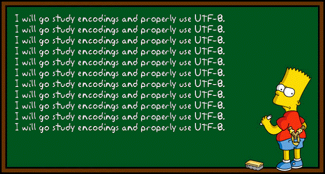
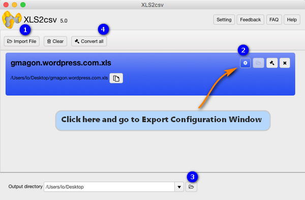
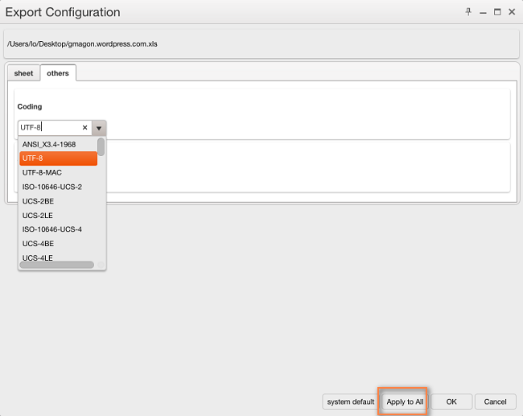

layout: guide
title: CSV UTF8 - Excel XLS to CSV with UTF-8 encoding   
keywords: change XLS to UTF-8 encoded CSV, an Excel to UTF-8 CSV converter, encoding Excel files into a UTF-8 CSV, batch convert XLS files to CSV format with UTF-8, XLS-to-CSV converter for Mac
description: Is it possible to convert Excel XLS files to CSV with UTF-8 encoding? To achieve the expected result, users sometimes need to change XLS to UTF-8 encoded CSV format. 
---

Is it possible to convert Excel XLS files to CSV with UTF-8 encoding? To achieve the expected result, users sometimes need to change XLS to UTF-8 encoded CSV format. That’s where an Excel to UTF-8 CSV converter comes in. In the tutorial below, we will guide you through how to do this in an easy way. 

On some occasions, encoding your Excel files into a UTF-8 CSV helps you ensure anything you use can be read and displayed properly. This is particularly important when working with foreign or special characters. Gmagon XLS2csv has the ability to batch convert XLS files to CSV format with UTF-8 encoding. Learn how to do this via using this app. 

About Gmagon XLS2csv 
Before we start, you may want to know more about <a href="https://gmagon.com/products/store/xls2csv/" target="_blank" rel="nofollow me noopener noreferrer" >Gmagon XLS2csv</a>. XLS2csv is a simple and intuitive XLS-to-CSV converter for Mac. It helps those who are looking for a solution to convert XLS files to CSV format on Mac OS X. The software can intelligently recognize a large number of XLS files and batch convert them to CSV format quickly. Users are allowed to drag-and-drop a file or directory to the interface of XLS2csv, and preview the loaded Excel spreadsheets before conversion. Plus, you can customize separators in the CSV as comma, semicolon, space, tab, full stop, etc. 
## How to process Excel XLS to CSV conversion with UTF-8 encoding?
Software requirement
Gmagon XLS2csv

**Note**: XLS2csv runs on Mac only, Mac OS X 10.7(64-bit) or above is required. 

Download, install and run Gmagon XLS2csv on your Mac, then follow the steps below to change XLS files to UTF-8 encoded CSV. 

Step 1: Drag and drop or click “Import File” to load XLS files that you want to convert. This Excel XLS to CSV converter for Mac supports batch conversion, so you can load multiple XLS files to do conversion at a time. 

Step 2: Go to Export Configuration Window and set UTF-8 as encoder 
In “Export Configuration” Window, switch to “others” column and choose “UTF-8” as coding method. If you've loaded a number of excel files to do conversion, do remember clicking “Apply to All”. 

Step 3: Set output directory for exported UTF-8 CSV files 

Step 4: Click “Convert all” button to start converting Excel files to UTF-8 encoded CSV on a Mac 
Once the conversion is complete, you can find the generated UTF-8 CSV files in the output directory. 

Hope this helps those who are looking for an easy solution to convert Excel xls files to CSV with UTF-8 encoding. 

Also read
<a href="https://gmagon.com/guide/xls2csv/export-to-csv-from-xls.html
" target="_blank" rel="nofollow me noopener noreferrer" >Export to CSV - exporting csv from xls files</a>
<a href="https://gmagon.com/guide/convert-xls-to-csv-on-mac.html" target="_blank" rel="nofollow me noopener noreferrer" >How to convert XLS to CSV on a Mac?</a>
<a href="https://gmagon.com/guide/convert-xls-on-mac-without-excel.html" target="_blank" rel="nofollow me noopener noreferrer" >Convert XLS to CSV on Mac without Excel installed</a>
<a href="https://gmagon.com/guide/apngtogif/batch-change-apng-to-gif-sierra.html" target="_blank" rel="nofollow me noopener noreferrer" >How to batch change APNG to GIF on macOS Sierra?</a>
