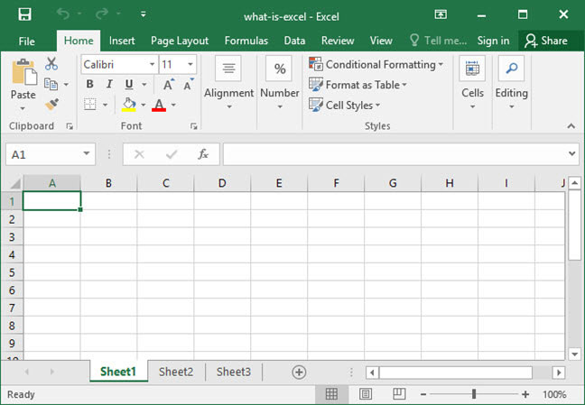
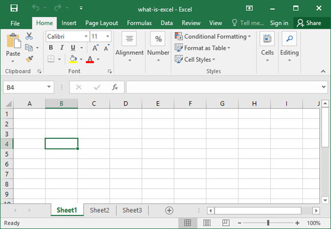

layout: guide
title: What is Microsoft Excel and Why It is Important?      
keywords: excel formulas, introduction a microsoft excel, what is a microsoft excel spreadsheet, a guide to microsoft excel, 
description: We write this article to help those who want to know what is Microsoft Excel and why it is important. 
---
 
## What is Excel?
Excel is an Electronic Spreadsheet Program. It is a computer software program from Microsoft that is part of the Microsoft Office suite of software programs. I was first released on September 30, 1985, and developed by Microsoft. Indeed, the personal computing renaissance of the 1980s and 1990s was largely driven by the many uses of Excel and other spreadsheet software. Excel is capable of Creating and editing spreadsheets that are saved with a .xls or .xlsx file extension. 

The electronic spreadsheet is a computer software program that is used for storing, organizing and manipulating data. It was originally based on paper spreadsheets used for accounting. As such, the basic layout of computerized spreadsheets is the same as the paper ones. Related data is stored in tables - which are a collection of small rectangular boxes or cells organized into rows and columns.

Current versions of Excel and other spreadsheet programs can store multiple spreadsheet pages in a single computer file. 

 
## Why use Excel?

Spreadsheets are extraordinarily powerful tools, they can be very useful for student interactive activities, and instructor use for developing materials for class, and they also used frequently in the business world to store and manipulate data. Besides, other common operations that Excel can be used are following:

* Graphing or charting data to assist users in identifying data trends;
* Formatting data to make important data easy to find and understand;
* Printing data and charts for use in reports;
* Sorting and filtering data to find specific information;
* Linking worksheet data and charts for use in other programs such as
* Microsoft PowerPoint and Word;
* Importing data from database programs for analysis.2

 
## Excel Overview

As you can see, the document is comprised of columns and rows. A cell lies at the intersection of each row and column that numbers or text can be entered.   

The address of any given cell is generated by combining the letter of the cell's column with the number of the cell's row. As the image above, the cell highlighted in the diagram is at address B4.  

There are more complex spreadsheets that can contains hundreds or even thousands of rows and columns,  the combination of which can represent millions of cells. These cells can be linked together with calculations and formulas to perform complex mathematical logic simply and easily.
 
>In addition, if you are looking for a way to convert Excel spreadsheets to tab delimited CSV files. With Gmagon <a href="https://gmagon.com/products/store/xls2csv/" target="_blank" rel="nofollow me noopener noreferrer" >XLS2csv</a> installed, it won’t be a problem to create tab delimited CSV files from Excel spreadsheets. This Mac app allows you to customize delimiters in CSV as comma, semicolon, space, tab, etc. Check a guide on how to do this in detail.   

Here’s what you need 
Gmagon XLS2csv

Note: Gmagon XLS2csv runs on Mac only, Mac OS X 10.7(64-bit) or above is required. 

Also read if you want to know more:
<a href="https://gmagon.com/guide/convert-xls-to-csv-on-mac.html" target="_blank" rel="nofollow me noopener noreferrer" >How to convert XLS to CSV on a Mac?</a>
<a href="http://gmagon.com/guide/xls2csv/newly-released-xls2csv-v5.1.html" target="_blank" rel="nofollow me noopener noreferrer" >The newly released Gmagon XLS2csv 5.1</a>
<a href="https://gmagon.com/guide/xls2csv/change-xlsx-to-csv.html
" target="_blank" rel="nofollow me noopener noreferrer" >To CSV - how do I change a .xlsx to a .csv? </a>
<a href="http://gmagon.com/guide/xls2csv/convert-excel-files-to-comma-csv.html" target="_blank" rel="nofollow me noopener noreferrer" >Convert Excel files to comma delimited CSV on Mac</a>