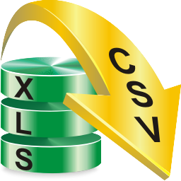

layout: guide
title: Export to CSV - exporting csv from xls files  
keywords: export a .csv file from a .xls file, converting Excel XLS files to CSV text, XLS2csv Converter, change xls to csv on a Mac, export CSV text files from XLS files on a Mac
description: How can I export a .csv file from a .xls file? Learn the way of converting Excel XLS files to CSV text file format via XLS2csv Converter. 
---

How can I export a .csv file from a .xls file? In this article, we will explain the way of converting Excel XLS files to CSV text file format via using a third party XLS2csv Converter app. 

Comma Separated Values (CSV) is a text file format that you can use to exchange data from a database or a spreadsheet between applications. Each line in a Text CSV file represents a record in the database, or a row in a spreadsheet. Each field in a database record or cell in a spreadsheet row is usually separated by a comma. However, you can use other characters to delimit a field, such as a tabulator character, a semicolon character or a full stop character. 

For those who need to change xls to csv on a Mac machine, <a href="https://gmagon.com/products/store/xls2csv/" target="_blank" rel="nofollow me noopener noreferrer" >Gmagon XLS2csv</a> is a good option. It recognizes xls files without MS Excel installed, and converts them to CSV format with your requested separators. Best of all, it supports batch conversion, which saves a lot of time to process tedious work. Check a quick guide on how to use this app to export CSV files. 
## How to export CSV from XLS files? 
First of all, download Gmagon XLS2csv 

**Note**: XLS2csv runs on Mac only, Mac OS X 10.7(64-bit) or above is required. 

Then follow these steps:
Step 1: Install and run XLS2csv on your Mac, and click “Import File” to load XLS files that you want to convert. This Mac XLS to CSV converter supports batch conversion, so you can load multiple XLS files to do conversion at a time. 

Step 2: Set output path for exported CSV files

Step 3: Click “Convert all” button to start. Once the conversion is complete, you can get the exported .csv files in output folder. 

Hope this XLS to CSV converter app helps those who are looking for an easy solution to export CSV text files from XLS files on a Mac computer. 

Also read
<a href="https://gmagon.com/guide/convert-xls-to-csv-on-mac.html" target="_blank" rel="nofollow me noopener noreferrer" >How to convert XLS to CSV on a Mac?</a>
<a href="https://gmagon.com/guide/create-border-radius-css-mac.html" target="_blank" rel="nofollow me noopener noreferrer" >How to create border radius CSS code on Mac?</a>
<a href="https://gmagon.com/guide/convert-xls-on-mac-without-excel.html" target="_blank" rel="nofollow me noopener noreferrer" >Convert XLS to CSV on Mac without Excel installed</a>
<a href="https://gmagon.com/guide/apngtogif/batch-change-apng-to-gif-sierra.html" target="_blank" rel="nofollow me noopener noreferrer" >How to batch change APNG to GIF on macOS Sierra?</a>
