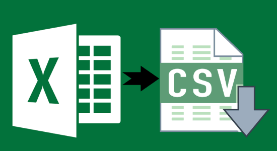

layout: guide
title: Large Excel (XLS/XLSX) file to CSV conversion     
keywords: issues converting large Excel files to CSV, large .xls/.xlsx to .csv conversion on Mac, change large Excel spreadsheets from XLS/XLSX to CSV 
description: Having issues converting large Excel files to CSV format? Learn how to process large .xls/.xlsx to .csv conversion on Mac OS X.  
---
Having issues converting large Excel files to CSV format? Learn how to process large .xls/.xlsx to .csv conversion on Mac OS X. 

There are lots of utilities out there having ability to change Excel spreadsheets from XLS or XLSX format to CSV format. But most of them are not good at handling large excel files, thus some data values were often converted incorrectly. To get the correct output, you will need a much more professional app such as Gmagon XLS2csv. This program works well with big Excel (XLS/XLSX) files, being able to convert them to CSV format on Mac in batch mode. You are allowed to drag-and-drop a file or directory to the app, and preview the loaded Excel spreadsheets before conversion. Plus, you can customize delimiters in the output CSV as comma, semicolon, space, tab, etc.

Download a free trial of Gmagon XLS2csv to see if it is able to do what you want.

### How to process large Excel (XLS/XLSX) file to CSV conversion on Mac? 
To convert large XLS/XLSX to CSV on Mac, follow these steps:
Step 1: Install and run Gmagon XLS2csv on your Mac, and click “Import File” to load large Excel files that you want to convert. This Mac Excel to CSV converter supports batch conversion, so you can load multiple big XLS/XLSX files to do conversion at a time. 

Step 2: Set output path for exported CSV files 

Step 3: Click “Convert all” button to start. Once the conversion is complete, you can get the exported .csv files in output folder. 

Hope this will help those who are looking for a solution to <a href="https://gmagon.com/products/store/xls2csv/" target="_blank" rel="nofollow me noopener noreferrer" >convert large Excel files to CSV format on a Mac</a>. 

Also read 
 <a href="https://gmagon.com/guide/mac-batch-convert-xls-to-csv.html" target="_blank" rel="nofollow me noopener noreferrer" >Mac batch convert XLS to CSV</a>
<a href="https://gmagon.com/guide/convert-xls-to-csv-on-mac.html" target="_blank" rel="nofollow me noopener noreferrer" >How to convert XLS to CSV on a Mac?</a>
<a href="https://gmagon.com/guide/xls2csv/csv-utf8.html" target="_blank" rel="nofollow me noopener noreferrer" >CSV UTF8 - Excel XLS to CSV with UTF-8 encoding</a>
<a href="https://gmagon.com/guide/convert-xls-on-mac-without-excel.html" target="_blank" rel="nofollow me noopener noreferrer" >Convert XLS to CSV on Mac without Excel installed</a>