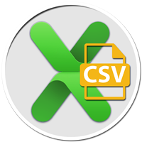

layout: guide
title: The newly released Gmagon XLS2csv 5.1 
keywords: Gmagon released XLS2csv 5.1, XLS2csv 5.1 new features, the newly released XLS2csv 5.1
description: Gmagon Software has recently released XLS2csv 5.1. What new features have been added to this version? Keep reading to learn more. 
---
Gmagon Software has recently released XLS2csv 5.1. What new features have been added to this version? Keep reading to learn more. 

The previous version 5.0 only comes with support for XLS files, while the newly released XLS2csv 5.1 features great ability to handle both XLS and XLSX files from Microsoft Excel, Apple Numbers, and Open Offices Excel. 

This Mac XLS2csv converter app can intelligently recognize large XLS/XLSX files as well as a group of XLS/XLSX files and batch convert them to CSV format quickly. Users are allowed to drag-and-drop a file or directory to the user interface, and preview the loaded spreadsheets before conversion. Plus, you can customize delimiters in generated CSV file as comma, semicolon, space, tab, etc. 
## How to use Gmagon XLS2csv 5.1 on a Mac? 
Check a user guide below: 

Download a free trial of Gmagon XLS2csv 5.1

Also read 
<a href="https://gmagon.com/guide/mac-batch-convert-xls-to-csv.html" target="_blank" rel="nofollow me noopener noreferrer" >Mac batch convert XLS to CSV</a>
<a href="https://gmagon.com/guide/how-to-convert-a-xlsx-file-to-csv-on-mac.html" target="_blank" rel="nofollow me noopener noreferrer" >How to convert a .xlsx file to .csv on Mac?</a>
<a href="https://gmagon.com/guide/create-border-radius-css-mac.html" target="_blank" rel="nofollow me noopener noreferrer" >How to create border radius CSS code on Mac?</a>
<a href="https://gmagon.com/guide/convert-xls-on-mac-without-excel.html" target="_blank" rel="nofollow me noopener noreferrer" >Convert XLS to CSV on Mac without Excel installed</a>
