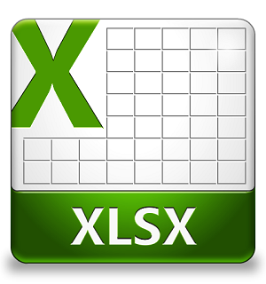

layout: guide
title: What is XLSX and how to transform XLSX to CSV? 
keywords: file extension ending in .xlsx, what XLSX is, transform documents from XLSX to CSV
description: This article explains what XLSX is and how to transform a set of documents from XLSX to CSV format.   
---
You're here because you have a file that has a file extension ending in .xlsx. This article explains what XLSX is and how to transform a set of documents from XLSX to CSV format.   

### What is XLSX? 
XLSX files are the default spreadsheet output documents of newer versions of Microsoft Excel, starting with Microsoft Office 2007. These XLSX files can also be opened with older versions of Microsoft Excel, though compatibility support must first be downloaded from the Microsoft website and installed in the system. Integrated with XML specifications, these XLSX files can be implemented into certain Web publishing applications and database programs. The data stored in an XLSX file usually consists of text, numerical data and stats that are entered by a user, and certain functions for automating mathematical calculations or text formatting options may also be implemented into an XLSX spreadsheet. These .xlsx documents are also integrated with compatibility support for VB scripting through macros. With a new GUI (Graphical User Interface) that comes bundled with these newer versions of Microsoft Excel, users can access the integrated features of this data management and spreadsheet software with ease, allowing them to create suitable document presentation materials.

### How to transform a set of documents from XLSX to CSV? 
Be careful not to rename the extension on .xlsx files, or any other files. This will not change the file type. Only special conversion software can change a file from one file type to another. Check the guide below and leanr how to transform a set of documents from XLSX to CSV format. 

Here’s what you need
Gmagon XLS2csv 

Note: XLS2csv runs on Mac only, Mac OS X 10.7(64-bit) or above is required. 

To transform documents from XLSX to CSV, follow these steps:
Step 1: Install and run XLS2csv on your Mac, and click “Import File” to load XLSX files that you want to convert. This Mac XLSX to CSV converter supports batch conversion, so you can load multiple XLSX files to do conversion at a time. 

Step 2: Set output path for exported CSV files 

Step 3: Click “Convert all” button to start. Once the conversion is complete, you can get the exported .csv files in output folder. 

That’s all. Hope this XLSX to CSV converter app helps those who are in search of a solution to transform a set of documents from XLSX to CSV format on a Mac. 

Also read 
<a href="https://gmagon.com/guide/mac-batch-convert-xls-to-csv.html" target="_blank" rel="nofollow me noopener noreferrer" >Mac batch convert XLS to CSV</a>
<a href="https://gmagon.com/guide/how-to-convert-a-xlsx-file-to-csv-on-mac.html" target="_blank" rel="nofollow me noopener noreferrer" >How to convert a .xlsx file to .csv on Mac?</a>
<a href="http://gmagon.com/guide/xls2csv/newly-released-xls2csv-v5.1.html
" target="_blank" rel="nofollow me noopener noreferrer" >The newly released Gmagon XLS2csv 5.1</a>
<a href="https://gmagon.com/guide/convert-xls-on-mac-without-excel.html" target="_blank" rel="nofollow me noopener noreferrer" >Convert XLS to CSV on Mac without Excel installed</a> 