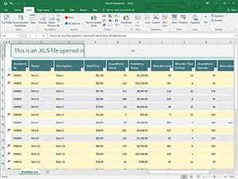

layout: guide
title: What Is An XLS File And How To Use It?    
keywords: xls file, xls file extension, xls viewer, xls binary file format, xls converter, what are xls files 
description: We write this article to help those who want to figure out what is an xls file and how to use it. 
---

## What is an XLS file?
XLS files are a spreadsheet file created by Microsoft Excel or another spreadsheet program, such as OpenOffice Calc or Apple Numbers. It stores data in worksheets, charts, and macros.   

An XLS spreadsheet is used for organizing, analyzing, manipulating, and visualizing data. The spreadsheet commonly consists of a table with rows and columns. The table cells in the file may contain manually entered data or the results computed from the data of other cells.

As the most widely used spreadsheet application in the world. It comes with every edition of the Microsoft Office suite and is used in home, academic, and business environments.

 
## How to open an XLS file?
Every version of Microsoft Excel can open XLS files. Besides, you can open XLS files without Microsoft Excel using Microsoft's free Excel Viewer, which supports opening and printing XLS files, as well as copying data out of them.

Several free alternatives to Excel that can be used to both open and edit XLS files include Kingsoft Spreadsheets and OpenOffice Calc. In Chrome, opening and editing XLS files is very easy. Without downloading them to your computer, you can open and edit XLS files you find online.

**Note**: Saving XLS files this way using the Chrome extension forces them to be stored in the newer XLSX format.

 
## How To Convert an XLS File?
You can convert  XLS files to various formats, such as  CSV, PDF, XPS, XML, TXT, XLSX, PRN, etc. Here we mainly talked about how to convert XLS files to Csv format.

If you don't have an XLS editor installed, or don't want to install one, using a document converter is another option. With Gmagon <a href="https://gmagon.com/products/store/xls2csv/" target="_blank" rel="nofollow me noopener noreferrer" >XLS2csv</a> installed, it won’t be a problem to create tab delimited CSV files from Excel spreadsheets.

 
Here’s what you need 
Gmagon XLS2csv

Note: Gmagon XLS2csv runs on Mac only, Mac OS X 10.7(64-bit) or above is required. 

 
Also read
 <a href="https://gmagon.com/guide/mac-batch-convert-xls-to-csv.html" target="_blank" rel="nofollow me noopener noreferrer" >Mac batch convert XLS to CSV</a>
<a href="https://gmagon.com/guide/convert-xls-to-csv-on-mac.html" target="_blank" rel="nofollow me noopener noreferrer" >How to convert XLS to CSV on a Mac?</a>
<a href="https://gmagon.com/guide/create-border-radius-css-mac.html" target="_blank" rel="nofollow me noopener noreferrer" >How to create border radius CSS code on Mac?</a>
<a href="https://gmagon.com/guide/how-do-i-convert-excel-to-csv-mac.html" target="_blank" rel="nofollow me noopener noreferrer" >How do I convert Excel to CSV on Mac?</a>
<a href="https://gmagon.com/guide/convert-xls-on-mac-without-excel.html" target="_blank" rel="nofollow me noopener noreferrer" >Convert XLS to CSV on Mac without Excel installed</a>
<a href="https://gmagon.com/guide/how-to-create-utf-8-csv-from-xls-mac.html" target="_blank" rel="nofollow me noopener noreferrer" >How to create UTF-8/UTF-16 CSV from XLS/XLSX on Mac?</a>