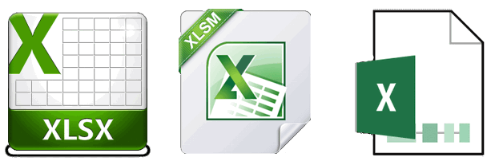

layout: guide
title: What’s the real difference between XLSX, XLSM and XLSB? 
keywords: extension XLSX, XLSM and XLSB, difference between XLSX, XLSM and XLSB
description: What’s the difference between XLSX, XLSM and XLSB? Read this article to find the answer.  
---
Microsoft Excel allows users saving spreadsheet in a variety of file formats with the extension XLSX, XLSM and XLSB. What’s the difference between XLSX, XLSM and XLSB? Read this article to find the answer. 

### What’s the real difference between XLSX, XLSM and XLSB? 
XLSX and XLSM are the successors of the old XLS format. While the old XLS format has stored the data binary, XLSX and XLSM are internally using the XML format (Extensible Markup Language).

The difference between XLSX and XLSM is that XLSX does not contain macros and in contract XLSM does. So, if you do not want to worry about any security settings, you can just choose the XLXS format for your spreadsheet. Macros are simply not stored when using the XLXS format.
- XLSX: Excel Workbook without Macros
- XLSM: Excel Workbook with activated Macros
- XLSB: Excel Binary Workbook

The XLSB format includes a binary workbook and thus is similar to the old BIFF format of <a href="http://gmagon.com/guide/xls2csv/xls.html" target="_blank">the XLS files</a>. The XLSB files have the advantage that they are smaller and can be processed and opened more quickly compared to the XML based formats XLSX and XLSM. Therefore, they are always a good choice when comprehensive data is available, if complex calculations must be calculated or if there are other limitations of the XML format.

By the way, you can open the XLXS and XLSM files in an archive program such as 7-Zip. Then you see the contained XML files.

Note that if you want to change a file format from one to another, you couldn’t just rename the file extension. You need to use a piece of converter software, such as Gmagon XLS2csv, which helps you convert .xls/.xlsx files to .csv text files in batch mode. 

Download Gmagon XLS2csv to have a try 

Note: XLS2csv runs on Mac only, Mac OS X 10.7(64-bit) or above is required. 

Also read
<a href="http://gmagon.com/guide/xls2csv/newly-released-xls2csv-v5.1.html
" target="_blank" rel="nofollow me noopener noreferrer" >The newly released Gmagon XLS2csv 5.1</a>
<a href="http://gmagon.com/guide/xls2csv/convert-excel-to-tab-delimited-csv.html" target="_blank" rel="nofollow me noopener noreferrer" >Convert Excel spreadsheets to tab delimited CSV</a>
<a href="http://gmagon.com/guide/xls2csv/xlsx-2-csv-converter.html" target="_blank" rel="nofollow me noopener noreferrer" >xlsx2csv Converter-convert multiple xlsx files to csv</a>
<a href="http://gmagon.com/guide/xls2csv/convert-excel-files-to-comma-csv.html" target="_blank" rel="nofollow me noopener noreferrer" >Convert Excel files to comma delimited CSV on Mac</a> 