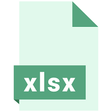
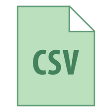

layout: guide
title: XLSX to CSV Converter for Mac (bulk conversion supported)  
keywords: xlsx to csv converter mac, xlsx to csv converter free download mac, bulk convert xlsx files to csv on mac, convert csv from .xls for Mac, convert xlsx to csv batch file
description: How to convert XLSX files to CSV on Mac ? Using a simple and helpful XLS to CSV Converter can help Mac users solve the problem. 
---

## What is XLSX?
XLSX is a file with XLSX extension Microsoft Excel Open Format Spreadsheet file. It is based on XML spreadsheet file which created by Microsoft Excel version 2007 and younger. 

XLSX files organize data in cells and then stored them in worksheet or workbooks (files that contain multiple worksheets). The cells are organized by rows and columns which contain formatting, math functions, styles, and more.

Compared with XLSX, XLS file is saved as a kind of a spreadsheet file that made in Excel earlier version. While XLSM file is an Excel file that support macros.
 

## Why XLSX need to be exported to CSV?
By far, Microsoft Excel is the most popular spreadsheet application used to store tabular data. While this data is stored in Excel files (.xls or .xlsx), it is generally being exported to .cvs format (comma separated values) for transmission purposes. 

CSV is an ideal format for the exchange of tabular data since it expresses it in form of textual data using delimiters, which are supported by various spreadsheet applications, or can easily be opened within simple text editors.

 
## How to open an ELSX file?
It is certain that Microsoft Excel version 2007 or newer is the primary software program used to open and edit XLSX files, you can install the Microsoft Office Compatibility Pack to open, edit, and save XLSX files using an older version of Excel. If you just want to view it, you can install the free Microsoft Office Excel Viewer. It supports printing and copying data out of the XLSX file too, which may be all you need to do. 

* Matter of fact, if you are able to operate Excel 2007 or younger in your computer, it will be an easiest way for you, because you can just open your XLSX file and save it as CSV format. However, as for a large majority of Mac users, the situation is probably get more complex. 

Fortunately, you can have an easy-to-use converter-<a href="https://gmagon.com/products/store/xls2csv/" target="_blank" rel="nofollow me noopener noreferrer" >XLS2csv</a> to do your favor with its powerful functions. With this handy desktop application, you can save hours of tedious manual file conversions.
 

## How to convert XLSX to CSV by XLS2csv?
**Step 1**: Import your Excel file or a batch of files into this converter by clicking.

**Step 2**: Set your output directory to put your output in the right file.

**Step 3**: If you want to preview the convert effects, you can see it clearly and also change its coding to CSV UTF-8, UCS-2BE, etc.

**Step 4**: The final step is to click the convert button, you can choose to convert one file at once or convert all files at one click.

 
**What's more, if you have more than one Excel files to be converted to CSV format,   XLS2csv is able to let you quickly convert multiple XLSX files to CSV format in one go. Now download it and give it a try.**

 
Also read
<a href="https://gmagon.com/guide/mac-batch-convert-xls-to-csv.html" target="_blank" rel="nofollow me noopener noreferrer" >Mac batch convert XLS to CSV</a>
<a href="https://gmagon.com/guide/how-to-convert-a-xlsx-file-to-csv-on-mac.html" target="_blank" rel="nofollow me noopener noreferrer" >How to convert a .xlsx file to .csv on Mac?</a>
<a href="https://gmagon.com/guide/create-border-radius-css-mac.html" target="_blank" rel="nofollow me noopener noreferrer" >How to create border radius CSS code on Mac?</a>
<a href="https://gmagon.com/guide/convert-xls-on-mac-without-excel.html" target="_blank" rel="nofollow me noopener noreferrer" >Convert XLS to CSV on Mac without Excel installed</a>
<a href="https://gmagon.com/guide/can-i-batch-convert-xls-to-csv-mac.html" target="_blank" rel="nofollow me noopener noreferrer" >Can I batch convert XLS/XLSX to CSV in Mac?</a>
