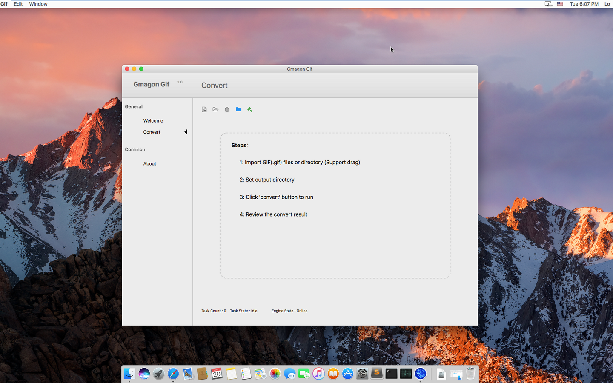

layout: app
title: ColorPicker2
subtitle: ColorPicker2
comments: false
current: index
---

## OVERVIEW

**ColorPicker2** is a streamlined graphical user interface utility that helps users to select different colors they want and sometimes to create color schemes. It is a quick and simple job for users to identify the colors, save, edit and combine them into beautiful color combinations. ColorPicker2 fits into any budget and grows with your needs. Try the ColorPicker2 now and see how it can make your job easier. Everything you need is contained in one simple installer, no additional downloads or plug-ins are required. We make it simple for you, now and later!

Learn more [about ColorPicker2](./features.html).

<a href="./download.html"><i class="fa fa-download fa-3x" aria-hidden="true"></i>  Download </a>
 

 

## USE CASES: BUILT FOR YOU
 ColorPicker2 aims to satisfy various requirements for different users. The color picker is used to select and adjust color values. In graphic design and image editing, users typically choose colors via an interface with a visual representation of a color—organized with quasi-perceptually-relevant hue, lightness, and saturation dimensions (HLS) – instead of keying in alphanumeric text values. Because color appearance depends on comparison of neighboring colors, many interfaces attempt to clarify the relationships between colors.

1. **Webmasters and Designers**: This color picker is specially suitable for webmasters and designers. It is a color picker with few extra goodies. When you run the software, it provides you the Hex, UIColor, and NSColor values of that color. You can then use these values to reproduce the selected color in your favorite programs. ColorPicker2 will also show the current coordinates of your mouse pointer. This tool makes it easy to create, adjust, and experiment with custom colors for the web.
 

 
 
1. **Graphic Designers and Digital Artists**: Users can use the color picker by clicking and dragging your cursor inside the picker area to highlight a color or input the Hex, UIColor, and NSColor to serach for a particular color in the fields below the color swatch, then click the swatch to add it to your palette. After selecting a color, experiment with different harmonies by using the dropdown below the color picker.
 

 

