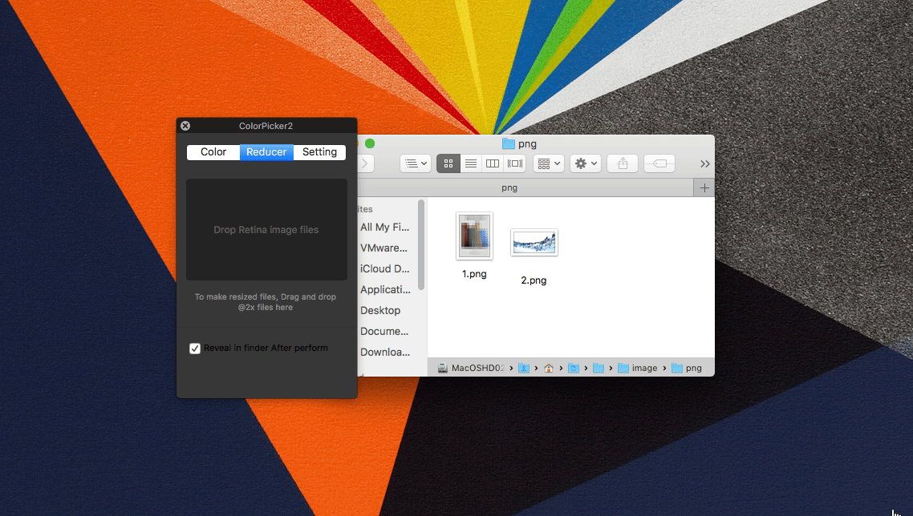

layout: app
title: ColorPicker2-pick colors from your Mac
subtitle: ColorPicker2
comments: false
current: index
keywords: color picker tool, color picker on mac, pick color from image, pick color for mac, color picker eyedropper
description: ColorPicker2 is a simple color picking tool to identify, edit and combine colors from everywhere in your Mac.
---

## OVERVIEW

**ColorPicker2** is a streamlined graphical user interface utility that helps users to pick different colors they want and sometimes to create color schemes. It is a quick and simple job for users to identify the colors, save, edit and combine them into beautiful color combinations. In short, ColorPicker2 is a distinct color picker tool or eyedropper that helps users to pick colors from images or screen on Mac. Try the ColorPicker2 now and see how it can make your job easier. Everything you need is contained in one simple installer, no additional downloads or plug-ins are required. We make it simple for you, now and later!

Learn more [about ColorPicker2](./features.html).

 

## USE CASES: BUILT FOR YOU
 ColorPicker2 aims to satisfy various requirements for different users. The color picker is used to select and adjust color values. In graphic design and image editing, users typically choose colors via an interface with a visual representation of a color—organized with quasi-perceptually-relevant hue, lightness, and saturation dimensions (HLS) – instead of keying in alphanumeric text values. Because color appearance depends on comparison of neighboring colors, many interfaces attempt to clarify the relationships between colors.

1. **Webmasters and Designers**: This color picker tool is specially suitable for webmasters and designers. When you run the software, it provides you the Hex, UIColor, and NSColor values of that color and three levels of quality. You can then use these values to reproduce the selected color in your favorite programs. ColorPicker2 will also show the current coordinates of your mouse pointer. This tool makes it easy to create, adjust, and experiment with custom colors for the web.
 

 
 
1. **Graphic Designers and Digital Artists**: Users can use the color picker tool by clicking and dragging your cursor inside the picker area to highlight a color or input the Hex, UIColor, and NSColor to search for a particular color in the fields below the color swatch, then click the swatch to add it to your palette. After selecting a color, experiment with different harmonies by using the dropdown below the color picker.
 

 

