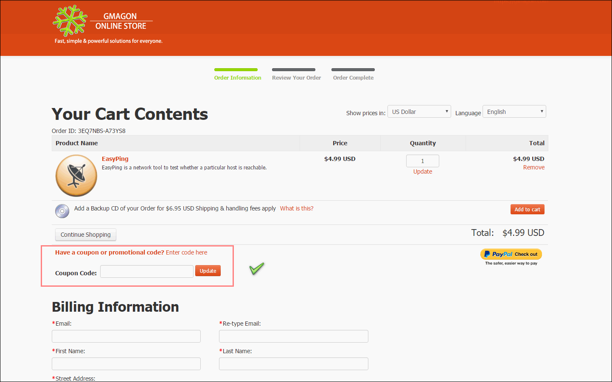

layout: app
title: Manual | EasyPing
subtitle: Documentation
comments: false
product: EasyPing
current: docs
---

# MANUAL
## EasyPing
A ping utility tool for **macOS**

Version 2.1

 

 ### **Preface**:

>Are you having network problems? 
>Have the network problems made you suffer from anxiety and loss?
 
If you have met such questions like that, you'd better consider EasyPing as your best choice. Give it a shot – we’re sure you’ll love the end result! If you are interested to know more about this product, and how the product can help you in your life, just read more below, and have a try, you can simply enjoy the excellent user experience delivered by our company.

 
### **Introduction**: 
The Ping utility is a system administrator's tool that is used to see if a computer is operating and also to see if network connections are intact. Ping uses the Internet Control Message Protocol (ICMP) Echo function which is detailed in RFC 792. A small packet is sent through the network to a particular IP address.  The computer that sent the packet then waits and listens for a return packet. If the connections are good and the target computer is up, a good return packet will be received. 

EasyPing is a software utility tha use the Internet Control Message Protocol (ICMP) to determine the availability and responsiveness of network hosts. The software is made for Mac users only (**macOS 10.7(64-bit)** or newer is required). users will be released from annoying ads, bundled softwares, plug-ins, even log in and registration. By simply enjoying the swift, comfortable operation of EasyPing, you are able to join our community and get our excellent after-sale services.  

 
### **Installation**:
EasyPing runs on Mac only, MacOS 10.7(64-bit) or newer is required. The new version 2.1 is released now in [DOWNLOAD](./download.html). There are two kind of install package in [DOWNLOAD](./download.html) page, you need to choose one suitable package, click it and wait for the downloading. Then choose a suitable folder to put the software in and click "open" to run it.   

When you open and run the software, the product interface will pop up. The following "User Guide" will instruct you how to operate it. 
If you encounter any problems during or after installing EasyPing please refer to [Frequently Asked Questions (FAQ)](./faq.html) first.

**The trial version** for users to try out is also available in [DOWNLOAD](./download.html), and combined with the install package.

 You can click and download one of the files. when you open and run the software, a little window will pop up. If you choose to try out, click "continue" button, you can freely try this software three times. If you wanna to buy our product, then click "Buy" button to enter the online store. 

 

If you encounter any problems during or after installing NetworkEyes please refer to [Frequently Asked Questions (FAQ)](./faq.html) first.

 
### **User Guide**:
This section describes daily use guide to the EasyPing clients. It instructs you how to use the software in details after the installation finished.
1. Firstly, you need to open the file and run it, the window of NetworkEyes will pop up in the desktop. As what have mentioned before, if you want to try out this software first, click "continue" to use the trial version, you have three chances to try it freely. If you satisfied with our product,and decided to pay for it, please click the "Buy" button or directly come to our home page and enter the [BUY ONLINE](./buy.html)
 
2. Secondly, in the BUY ONLINE page, there are two optional purchase link for you, that is, you can choose to buy from our **official App store** or the Apple App store. The good news is, we offer a **coupon code** below the purchase link for anyone who willing to buy from the Gmagon official App store. 
 
 
 
3. Thirdly, in the Gmagon Online Store, you need to put the product in your cart, fill the Billing Information, choose your payment information, and then finish the whole purchase process.
 
 
 
4. Finally, after you finished the purchasing process of the product, you can get the **active code** from us. When you run the software, a registered window will pop up, then you need to copy and paste the active code in the **license key** text box, then click "register" button to finish the License Activation.
 
  
 
Hope the EasyPing will help you enjoy a high-quality user experience and make your life more convenient than ever. We'd like to receive and answer any question from you, if you are willing to communicate with us in <a href="https://gitter.im/Gmagon/support" target="_blank"> <strong>Support Center</strong> </a> and join our community. We will strive to provide the best services we can offer with our customers. 
