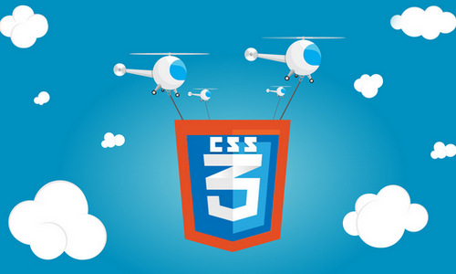

layout: app
title: Gmagon CSS Maker-a fabulous CSS designer on Mac 
subtitle: Gmagon CSS Maker 
comments: false
current: index
keywords: css generator for mac, css designer on mac, css transition, web design, web authoring, html css maker
description: As a good CSS maker for Mac, Gmagon CSS Maker is your smart choice to create HTML CSS and build websites. 
---

## OVERVIEW

**Gmagon CSS Maker** is a powerful and advanced CSS2/CSS3 generator on Mac that allows you creating a nice look without writing a code. As a powerful and easy-to-use CSS designer, Gmagon CSS Maker minimizes your time and efforts spent on creating complex CSS styles. With this handy generator, you can easily create numerous graphic styles and immediately get your code or code of separate elements within seconds. Gmagon CSS Maker fits into any budget and grows with your needs. Try the Gmagon CSS Maker now and see how it can make your job easier. Everything you need is contained in one simple installer, no additional downloads or plug-ins are required. We make it simple for you, now and later!

Learn more [about Gmagon CSS Maker ](./features.html).

 
 

## USE CASES: BUILT FOR YOU
Gmagon CSS Maker can be used to define box, gradients, text shadows, box shadows, transforms, transitions and rotations by adjusting a few sliders. The result can be previewed flexibly in preview panel before output. The CSS designer will help you create modern CSS code to cut and paste into your stylesheet. In short, Gmagon CSS Maker aims to save your time and upgrade your working efficiency with web on Mac. Not only Gmagon CSS Maker is tailor-made for professional web designers, web masters, and designers, but also fit for the very demand of novices of HTML CSS, for who are not masters in coding can use it easily and quickly without remember the whole code. 

1. **Web masters and Designers**: Professional web masters or developers are usually familiar with the coding process, but it is obviously time-consuming. With our handy software, you are able to finish HTML page within several minutes. What you only need to do is to copy and paste the codes which are generated by this tool automatically.

 
3. **Novice of HTML CSS**: For a website building novice, is too difficult to remember all the code of all elements. The Gmagon CSS Maker will release them from complex coding skills, and allow them to build stylish and attractive websites with no hassles at all. It enables them to create websites in mere few minutes, and it is solid and stable.

 
4. **Entrepreneur**: Sometimes, a businessman need to frequently put up great web pages and small sites for new ideas, products, events, etc. in the course of running one's business. As coding dumdums, people all over the world will flock to the Gmagon CSS Maker in order to produce fabulous and stable sites without true coding skills.
1. 

  
1. **Graphic Designer**: A creative graphic designer is used to consider of ways around the limited design options to create the unique looks that he or she built for clients using the background image option.
