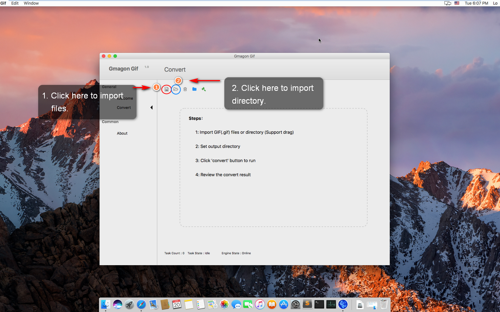
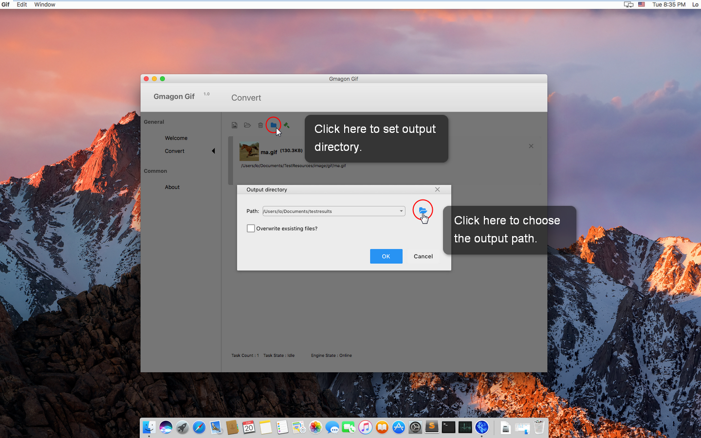
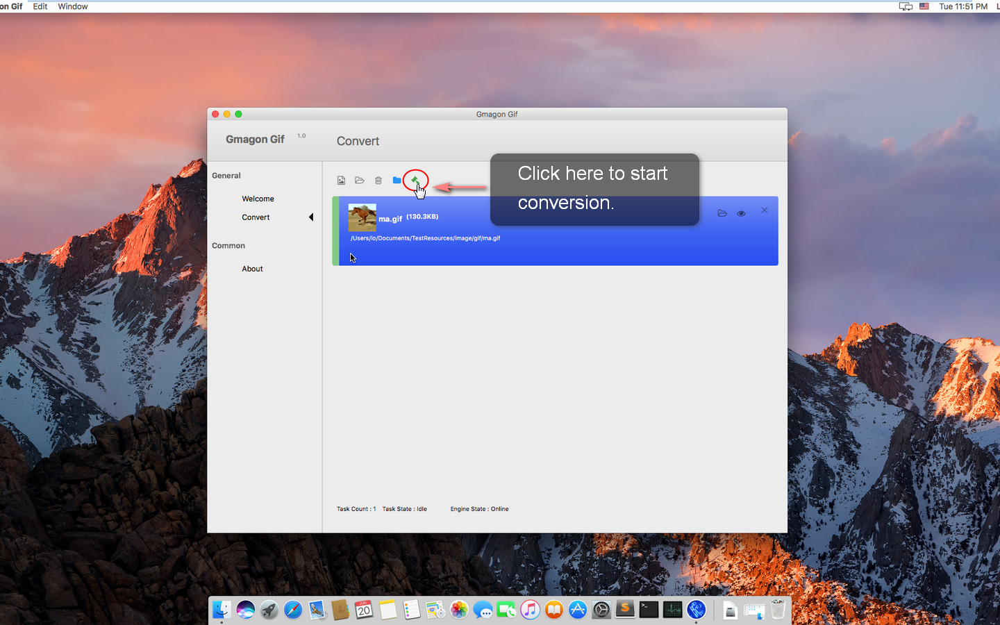

layout: app
title: Manual | Gmagon Gif
subtitle: Documentation
comments: false
product: Gmagon Gif
current: docs
---

# MANUAL
## Gmagon Gif
A GIF to APNG converter and gallery for **macOS**

Version 1.0

 

 ### **Preface**:

>Do you like to use animated memes to express your emotion on your social network? Not only memes GIFs go viral in Internet, many blogs use GIFs as illustration so as to make the content more vivid and impressive. GIFs are suitable for sharp-edged line art with a limited number of colors, such as logos, graphics. It is also good for advertising, especially in the social networking, because it can show more information in the same time and easy to tell at a glance. Compared to GIF, animated PNG format is able to support alpha transparency, while lacking transparency leads to rough edges in display. APNG takes advantage of the format's lossless compression, which favors flat areas of uniform color with well defined edges. The question is how to change GIF to APNG?

Gmagon Gif is the first version of a series products that we produced for the convenience of GIF users, it only aims to the format conversion from GIF to APNG. The upcoming version will provide much more amazing functions and services for all users. If you are interested to know more about this product, and how the product can help you in your life, just read more below, and have a try, you can simply enjoy the excellent user experience delivered by our company.

 
 ### **Introduction**:
GIF, which stands for Graphics Interchange Format, it is a bitmap image format. Since its inception, it comes into widespread usage on the World Wide Web due to its wide support and portability. APNG is also called animated PNG, it refers to Animated Portable Network Graphics which presents an extension to the Portable Network Graphics (PNG) specification. It allows for animated PNG files that work similarly to animated GIF files, while supporting 24-bit images and 8-bit transparency not available for GIFs.

Gmagon Gif is an image format converter which tends to convert GIFs to APNG format. The software is made for Mac users only (**macOS 10.11(64-bit)** or newer is required). The software is so convenient that users can easily get the conversion result by simply clicking one button in it. The conversion process in our product is simple and efficient, users will be released from annoying ads, bundled softwares, plug-ins, even log in and registration. By simply enjoying the swift, comfortable operation of Gmagon Gif, you are able to join our community and get our excellent after-sale services.  

 
### **Installation**:
Gmagon Gif runs on Mac only, MacOS 10.11(64-bit) or newer is required. The new version 1.0 is released now in [DOWNLOAD](./download.html). The upcoming versions of Gmagon Gif is tend to complete other related services about GIFs. For it is a free product we offer for users, so users can feel free to download the software in our download page of the official website.

There are two kinds of install package in [DOWNLOAD](./download.html) page, you need to choose one suitable package, click it and wait for the downloading. Then choose a suitable folder to put the software in and click "open" to run it.   

When you open and run the software, the product interface will pop up. The following "User Guide" will instruct you how to operate it. 

If you encounter any problems during or after installing Gmagon Gif please refer to [Frequently Asked Questions (FAQ)](./faq.html) first.

 
### **User Guide**:
This section describes daily use guide to the Gmagon Gif clients. It instructs you how to use the software in details after the installation finished.
1. Firstly, you need to open the file and run it, the window of Gmagon Gif will pop up in the desktop. You can find the "Convert" in the "General" directory at the left side of the interface. Click the "Convert" button to enter the conversion interface, there are four steps to guide you how to use it.
 
 
 
2. Secondly, we provide two ways for users to import their GIF files. On the one hand, you can import your GIF file once a time by clicking the first button on the left, or you can click the second button on the left to import a directory. On the other,you can directly drag a file or directory from your folder to the interface.
 
 
 
3. Thirdly, before the conversion begin, users need to set their target output directory by clicking "output directory", so as to save the conversion result.
 
 
 
4. Finally, after you finish all the procedures above, you can click the "Convert" button to run it. When the conversion finished, you can also review your convert result to check its situation.
 
  
 
Hope the Gmagon Gif will help you enjoy a high-quality user experience and make your life more convenient than ever. We'd like to receive and answer any question from you, if you are willing to communicate with us in <a href="https://gitter.im/Gmagon/support" target="_blank" rel="nofollow me noopener noreferrer"> <strong>Support Center</strong> </a> and join our community. We will strive to provide the best services we can offer with our customers. 
