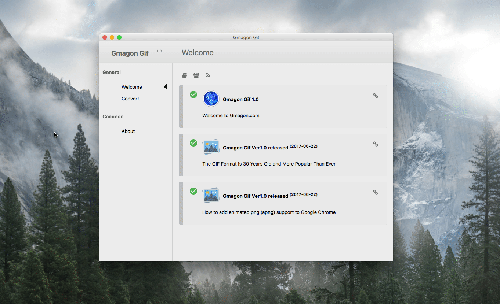
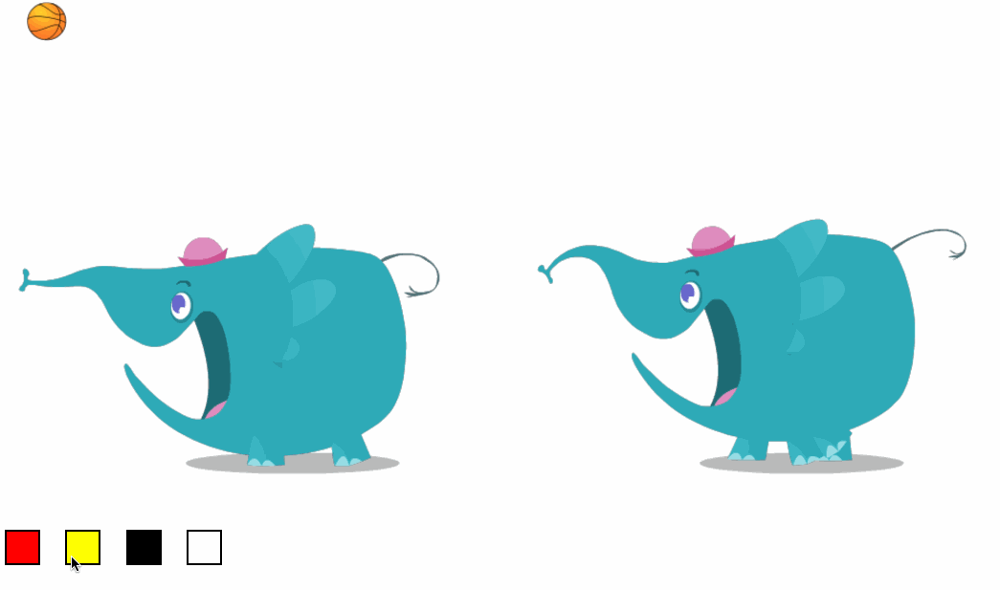

layout: app
title: Gmagon Gif - convert GIF to animated PNG on Mac 
subtitle: Gmagon Gif
comments: false
current: index
keywords: convert gif to apng on mac, mac gif to apng converter, gif to animated png converter for mac, gif to apng converter on mac, change gif to apng
description: Gmagon Gif is the best GIF to APNG converter for Mac. It helps users convert GIF files to animated PNG on Mac easily with very good quality. 
---

## OVERVIEW

**Gmagon Gif** is a minimum and streamlined converter that easily converts the GIF format out there to APNG format on Mac. In addition, it is also a multifunctional GIF tool including GIF gallery in its more advanced version. This GIF to APNG converter is the first version of a series of Gmagon GIF products for Mac. The software can intelligently recognize Gif files or directory and transform them to animated PNG files quickly. Without log in and registration, or any plug-in, you can simply enjoy swift conversion experience anytime and everywhere. It is a thrilling news for you to hear that this amazing mac gif to apng converter is free for all users!

Learn more [about Gmagon Gif](./features.html).

 

## USE CASES: BUILT FOR YOU
 Gmagon Gif aims to satisfy various requirements for different users. The full name of GIF is the Graphics Interchange Format. It is a bitmap image format that is widely used on the World Wide Web. GIFs are suitable for sharp-edged line art (such as logos) with a limited number of colors. However, rough edges are likely to appear when applying GIF files because it doesn't support alpha transparency like PNG does. Though both files are lossless, APNG is smaller and have better quality which supports more colors and transparency. More browsers support APNG now, particularly iOS Safari and Mac Safari, Mozilla Firefox, Opera and Google chrome.

1. **Designers**: If a designer use GIF file in logo designing or else, he or she probably find that the GIF have rough edges and poor quality in Github. It is far beyond what they supposed before. While APNG not only solve the rough edges problems, but also save much room for its smaller size. Animated PNG is an obvious choice for designers who search for high quality and smaller size. 
 

(The elephant in the left side is GIF format, APNG is in the right.)
 
 
1. **Memes Maker**: Memes are virally-transmitted cultural symbols. Memes can both be pictures and videos. Memes GIFs are popular all over the world in the Internet, and a large amount of netizen are likely to make their own unique memes. This tool is able to make their memes more transparent and clear.                                            
 

 
1. **Small Animations and Film Clips**: If you want to cut some episodes from an animation or a film and put them to other uses, APNG is tend to help users to enjoy the quick conversion experience delivered by our tool.
 

 

