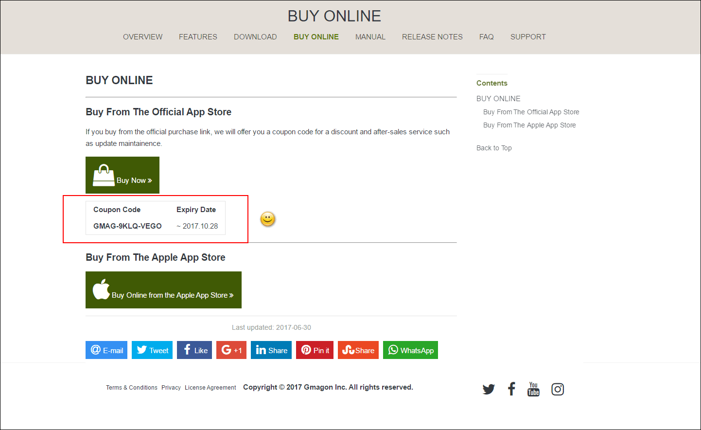

layout: app
title: Manual | NetworkEyes
subtitle: Documentation
comments: false
product: NetworkEyes
current: docs
---

# MANUAL
## NetworkEyes
An advanced monitoring tool for **macOS**

Version 3.19.0

 

 ### **Preface**:

>Have you ever found that the logo of network connection is normal, but you still cannot open your wen page or send out your email? Does such situation makes you feel that your network is out of control sometimes? Maybe you can let NetworkEyes helps you to uncover the true situation of your computer and solve your problems at the same time. It is easy to install and apply in your network.

 
 ### **Introduction**:
NetworkEyes is a network monitoring tool that helps you to ensure that your computer systems are running smoothly and that no outages occur. 
If you are interested to know more about this product, and how the product can help you in your life, just read more below, and have a try, you can simply enjoy the excellent user experience delivered by our company.

The software is made for Mac users only (**macOS 10.7(64-bit)** or newer is required). A good network monitor should be easy to install and usage should be intuitive, so that there is no need for external consultancy and training. Besides, they will be released from annoying ads, bundled softwares, plug-ins, even log in and registration, for the interface of this game is clean and concise. By simply enjoying the swift, comfortable operation of NetworkEyes, you are able to join our community and get our excellent after-sale services.  

 
### **Installation**:
NetworkEyes runs on Mac only, MacOS 10.7(64-bit) or newer is required. The new version 3.19.0 is released now in [DOWNLOAD](./download.html).  Players can download the software in our download page of the official website. 

There are two kinds of install package in [DOWNLOAD](./download.html) page, you need to choose one suitable package, click it and wait for the downloading. Then choose a suitable folder to put the software in and click "open" to run it.   

**The trial version** for users to try out is also available in [DOWNLOAD](./download.html), and combined with the install package.

 You can click and download one of the files. when you open and run the software, a little window will pop up. If you choose to try out, click "continue" button, you can freely try this software three times. If you wanna to buy our product, then click "Buy" button to enter the online store. 

 

If you encounter any problems during or after installing NetworkEyes please refer to [Frequently Asked Questions (FAQ)](./faq.html) first.

 
### **User Guide**:
This section describes daily use guide to the NetworkEyes clients. It instructs you how to use the software in details after the installation finished.
1. Firstly, you need to open the file and run it, the window of NetworkEyes will pop up in the desktop. As what have mentioned before, if you want to try out this software first, click "continue" to use the trial version, you have three chances to try it freely. If you satisfied with our product,and decided to pay for it, please click the "Buy" button or directly come to our home page and enter the [BUY ONLINE](./buy.html)
 
2. Secondly, in the BUY ONLINE page, there are two optional purchase link for you, that is, you can choose to buy from our **official App store** or the Apple App store. The good news is, we offer a **coupon code** below the purchase link for anyone who willing to buy from the Gmagon official App store. 
 
 
 
3. Thirdly, in the Gmagon Online Store, you need to put the product in your cart, fill the Billing Information, choose your payment information, and then finish the whole purchase process.
 
 
 
4. Finally, after you finished the purchasing process of the product, you can get the **active code** from us. When you run the software, a registered window will pop up, then you need to copy and paste the active code in the **license key** text box, then click "register" button to finish the License Activation.
 
  
 

>When the NetworkEyes is running in your computer, it is only manifested as a tiny circle in the top right of the toolbar in your desktop. The change of colors of the circle will tell you the true condition of your network. When the circle turns green, it means your network connection is stable and normal. When the circle turn yellow, the network speed is slow. When it turns red, it means your network is not stable. In addition, other options can be choose by clicking.
 
  
 

Hope the NetworkEyes will help you enjoy a high-quality user experience and make your life more convenient than ever. We'd like to receive and answer any question from you, if you are willing to communicate with us in <a href="https://gitter.im/Gmagon/support" target="_blank"> <strong>Support Center</strong> </a> and join our community. We will strive to provide the best services we can offer with our customers. 
