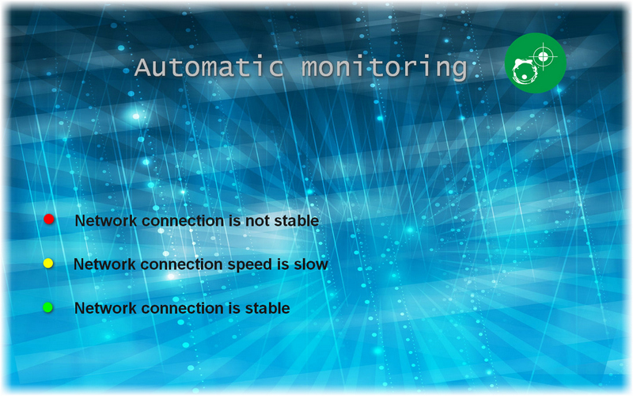

layout: app
title: NetworkEyes
subtitle: NetworkEyes
comments: false
current: index
---

## OVERVIEW

**NetworkEyes** is a network monitoring tool for Mac OS that displays network conditions in real-time. It is designed to help you to ensure that your computer systems are running smoothly and that no outages occur. Network monitoring is also important to increase the efficiency of your network by knowing bandwidth and resource consumption. NetworkEyes fits into any budget and grows with your needs. Try the NetworkEyes now and see how it can make your network more reliable and your job easier. Everything you need is contained in one simple installer, no additional downloads or plug-ins are required. We make it simple for you, now and later!

Learn more [about NetworkEyes](./features.html).

<!--  -->

 

## USE CASES: BUILT FOR YOU
 NetworkEyes aims to satisfy various requirements for different users. As an advanced monitoring tool, NetworkEyes is able to help users monitor their computer system, so as to increase the efficiency of your network. It is a powerful and widely-used network monitoring software. You should use NetworkEyes, if you would like to:  

● Increase profits by avoiding losses caused by undetected system failures.
 
● Reduce costs by buying bandwidth and hardware according to actual load.                                          
 
● Eliminate server performance problems and bandwidth bottlenecks.
 
● Improve quality of service through being proactive.
 

