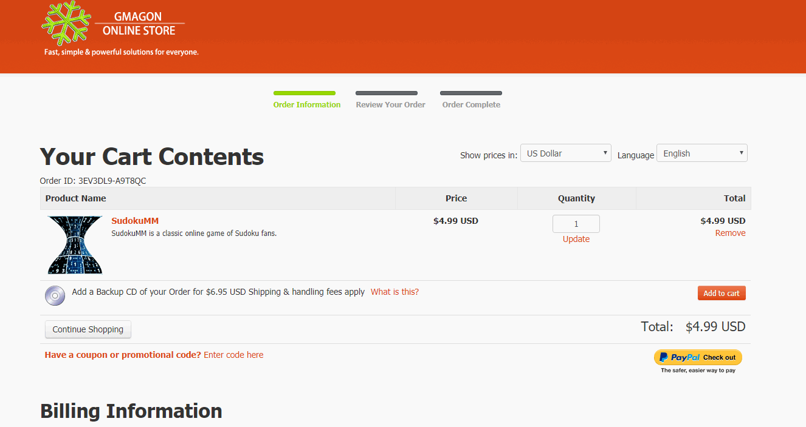

layout: app
title: Manual | SudokuMM
subtitle: Documentation
comments: false
product: SudokuMM
current: docs
---

# MANUAL
## SudokuMM
An online Sudoku game for **macOS**

Version 4.0

 

 ### **Preface**:

>Number puzzles first appeared in newspapers in the late 19th century in France, but  It was not a Sudoku because it contained double-digit numbers and required arithmetic rather than logic to solve, but it shared key characteristics. The modern Sudoku was first published in 1979 by a retired architect and freelance puzzle constructor. In 1984, The puzzle was introduced in Japan by Nikoli in the paper Monthly Nikolist, later it was called Sudoku, and rapidly spread to newspapers as a regular feature all over the world. 

 
 ### **Introduction**:
SudokuMM is an online game for classic Sudoku on Mac. It is a good news for Sudoku lovers for its convenience and simple operation. If you are interested to know more about this product, and how the product can help you in your life, just read more below, and have a try, you can simply enjoy the excellent user experience delivered by our company.

The software is made for Mac users only (**macOS 10.11(64-bit)** or newer is required). The software is so convenient that players can enjoy Sudoku at different level in their own PC. Besides, they will be released from annoying ads, bundled softwares, plug-ins, even log in and registration, for the interface of this game is clean and concise. By simply enjoying the swift, comfortable operation of SudokuMM, you are able to join our community and get our excellent after-sale services.  

 
### **Installation**:
SudokuMM runs on Mac only, MacOS 10.11(64-bit) or newer is required. The new version 4.0 is released now in [DOWNLOAD](./download.html).  Players can download the software in our download page of the official website. Older version is also provided in Older Releases in [DOWNLOAD](./download.html). 

There are two kind of install package in [DOWNLOAD](./download.html) page, you need to choose one suitable package, click it and wait for the downloading. Then choose a suitable folder to put the software in and click "open" to run it.   

**The trial version** for users to try out is also available in [DOWNLOAD](./download.html), and combined with the install package.

 You can click and download one of the files. when you open and run the software, a little window will pop up. If you choose to try out, click "continue" button, you can freely try this software three times. If you wanna to buy our product, then click "Buy" button to enter the online store. 

 

If you encounter any problems during or after installing SudokuMM please refer to [Frequently Asked Questions (FAQ)](./faq.html) first.

 
### **User Guide**:
This section describes daily use guide to the SudokuMM clients. It instructs you how to use the software in details after the installation finished.
1. Firstly, you need to open the file and run it, the window of SudokuMM will pop up in the desktop.  As what have mentioned before, if you want to try out this software first, click "continue" to use the trial version, you have three chances to try it freely. If you satisfied with our product,and decided to pay for it, please click the "Buy" button or directly come to our home page and enter the [BUY ONLINE](./buy.html).
 

 
2. Secondly, in the BUY ONLINE page, there are two optional purchase link for you, that is, you can choose to buy from our **official App store** or the Apple App store. The good news is, we offer a **coupon code** below the purchase link for anyone who willing to buy from the Gmagon official App store. 
 
 
 
3. Thirdly, in the Gmagon Online Store, you need to put the product in your cart, fill the Billing Information, choose your payment information, and then finish the whole purchase process.
 
 
 
4. Finally, after you finished the purchasing process of the product, you can get the **active code** from us. When you run the software, a registered window will pop up, then you need to copy and paste the active code in the **license key** text box, then click "register" button to finish the License Activation.
 
  
 
Hope the SudokuMM will help you enjoy a high-quality user experience and make your life more convenient than ever. We'd like to receive and answer any question from you, if you are willing to communicate with us in <a href="https://gitter.im/Gmagon/support" target="_blank"> <strong>Support Center</strong> </a> and join our community. We will strive to provide the best services we can offer with our customers. 
