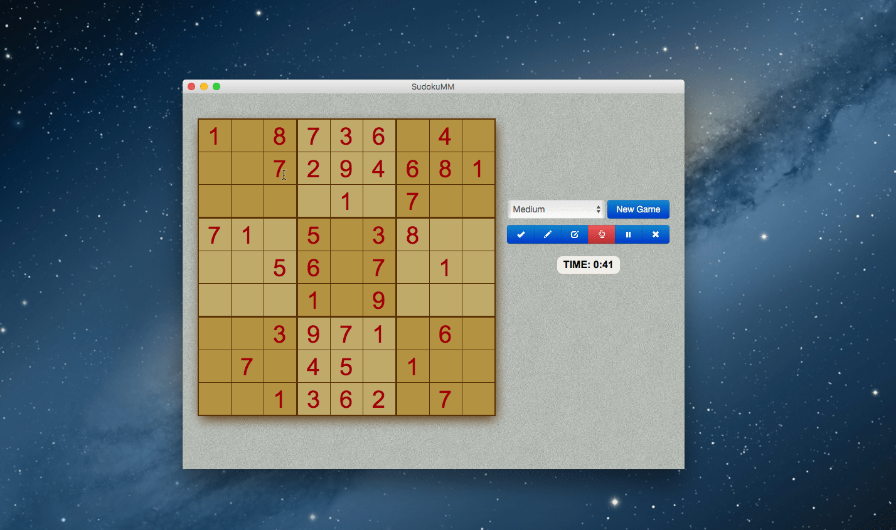

layout: app
title: SudokuMM-a classic Sudoku game on Mac
subtitle: SudokuMM 
comments: false
current: index
keywords: daily sudoku puzzles on mac, best sudoku game on mac, sudoku download for mac, brain training game, select a puzzle by difficult level
description: SudokuMM is a easy-to-use tool to let users play Sudoku games conveniently and provide four difficult levels.
---

## OVERVIEW

**SudokuMM** is a classic Sudoku game which is one of the most popular puzzle games of all time. It is a convenient and minimum tool designed for Sudoku fans all over the world. With SudokuMM, you can feel free to play Sudoku puzzle on your Mac anytime and everywhere. There are four levels of difficulty to choose, you can select a puzzle by different difficult level without worrying about it's too difficult or too easy to play. Without log in and registration, or any plug-in, you can simply enjoy the excellent experience anytime and everywhere. Start a game now. Within no time daily Sudoku will be your favorite game on Mac.

 

<h3>Price: $4.99 
</h3>
 

 

## USE CASES: BUILT FOR YOU
The popular Japanese puzzle game Sudoku is based on the logical placement of numbers. An online game of logic, Sudoku doesn’t require any calculation nor special math skills; all that is needed are brains and concentration. The goal of Sudoku is to fill a 9×9 grid with numbers so that each row, column and 3×3 section contain all of the digits between 1 and 9. Your job is to use logic to fill in the missing digits and complete the grid. As a logic puzzle, Sudoku is also an excellent brain game. If you play Sudoku daily, you will soon start to see improvements in your concentration and overall brain power. 

1. **Students**: The game of Sudoku is designed to help keep certain parts of the brain active. The American Alzheimer’s Association has endorsed Sudoku as a “brain training game”. Just like physical exercise, your mind need some exercise too. Playing sudoku actually exercises your brain extensively. As for students, their memory and logic could work side-by-side when you are playing Sudoku, and it will eventually improve their number skills.
 

 
1. **Adults**: Even you do not need to achieve high scores in test anymore, you cannot to stop exercising your brain and improving your ability to think. For example, you need to practice your logical thinking and work efficiency. Through playing Sudoku, players are required to think strategically and solve problems creatively Once you stop playing in the middle of the game, you have to start the whole thinking process, which helps you to develop your concentration power and re-focus skills.   

 
1. **Anyone**: In fact, Sudoku is benefit for all kinds of people, and it is fun for all ages.  Sudoku can  even be a fun game for parents to play with their children – you can  both sit together and help your child learn how to fill in the spaces on  the grid, teaching logical problem-solving skills and helping your  child feel a sense of accomplishment with each puzzle solved. In addition, researches show that puzzle games like Sudoku might be a good way to reduce risk of dementia and Alzheimeras as people get older. 
 

 

By playing Sudoku more often, you can solve the puzzle faster and eventually advance to a harder level. Exercise your mind and you will become happier and smarter.From now on, spare a little time to play Sudoku everyday!