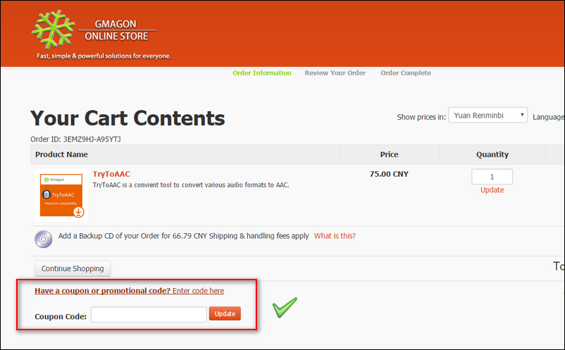
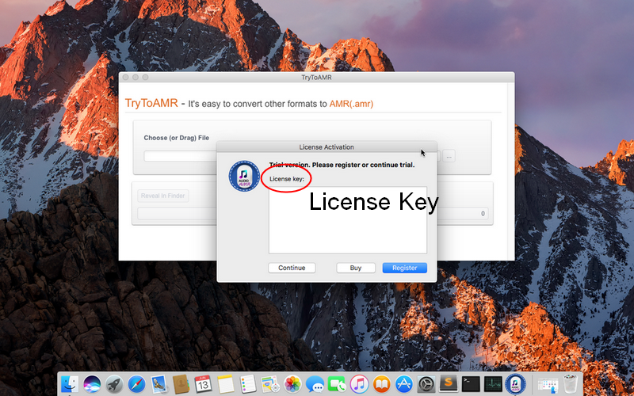

layout: app
title: Manual | TryToAMR
subtitle: Documentation
comments: false
product: TryToAMR
current: docs
---

# MANUAL
## TryToAMR
An audio converter for Mac

Version 4.0

 

 ### **Preface**:

>Are you tired of dull and noisy rings in your mobile phone?

>Do you enjoy self-made CRBT and storing important spoken audio?

>Have you got into trouble when you try to convert some audio formats to another ?

  If you answered "yes" to at least one of these questions, then TryToAMR is definitely designed for you. If you are interested to know more about this product, and how the product can help you in your life, just read more below, and have a try, you can simply enjoy the excellent user experience by our company.

 
 ### **Introduction**:
AMR, which stands for Adaptive Multi-Rate audio codec, is an audio compression format optimized for speech coding. AMR was adopted as the standard speech codec by 3GPP in October 1999 and is now widely used in GSM[4] and UMTS. AMR speech codec consists of a multi-rate narrowband speech codec that encodes narrowband (200–3400 Hz) signals at variable bit rates ranging from 4.75 to 12.2 kbit/s with toll quality speech starting at 7.4 kbit/s. It uses link adaptation to select from one of eight different bit rates based on link conditions.

TryToAMR is an audio converter tool which aims to convert various audio formats to the AMR format. The software is made for Mac users only (MacOSX 10.7 mac OS (64-bit) or newer is required). The software is so convenient that users can easily get the transformation result by simply clicking one button in it. Most audio formats in Internet can be intelligently recognized by TryToAMR and transfered as AMR format. The transformation process in our product is simple and efficient, users will be released from annoying ads, bundled softwares, plug-ins, even log in and registration. By simply enjoying the swift, comfortable operation of TryToAMR, you are able to join our community and get our excellent after-sale services.  

 
### **Installation**:
TryToAMR runs on Mac only, MacOSX 10.7 mac OS (64-bit) or newer is required. A new version 4.0 is updated recently. Older version is also provided in Older Releases in [DOWNLOAD](./download.html). 

There are three kind of install package in DOWNLOAD page, you need to choose one suitable package, click it and wait for the downloading. Then choose a suitable folder to put the software in and click "open" to run it.   

**The trial version** for users is also available in [DOWNLOAD](./download.html), and combined with the install package.

 You can click and download one of the files. when you open and run the software, a little window will pop up. If you choose to try out, click "continue" button, you can freely try this software three times. If you wanna to buy our product, then click "Buy" button to enter the online store. 

 

If you encounter any problems during or after installing TryToAMR please refer to [Frequently Asked Questions (FAQ)](./faq.html) first.

 
### **User Guide**:
This section describes daily use guide to the TryToAMR client. It instructs you how to use the software in details after the installation finished.
1. Firstly, you need to open the file and run it, the window of TryToAMR will pop up in the desktop. As what have mentioned before, if you want to try out this software first, click "continue" to use the trial version, you have three chances to try it freely. If you satisfied with our product,and decided to pay for it, please click the "Buy" button or directly come to our home page and enter the [BUY ONLINE](./buy.html).
 
2. Secondly, in the BUY ONLINE page, there are two optional purchase link for you, that is, you can choose to buy from our **official App store** or the Apple App store. The good news is, we offer a **coupon code** below the purchase link for anyone who willing to buy from the Gmagon official App store. 
 
 
 
3. Thirdly, in the Gmagon Online Store, you need to put the product in your cart, fill the Billing Information, choose your payment information, and then finish the whole purchase process.
 
 
 
4. Finally, after you finished the purchasing process of the product, you can get the **active code** from us. When you run the software, a registered window will pop up, then you need to copy and paste the active code in the **license key** text box, then click "register" button to finish the License Activation.
 
  
 
Hope the TryToAMR will help you enjoy a high-quality listening experience and make your life more convenient than ever. We'd like to receive and answer any question from you, if you are willing to communicate with us in <a href="https://gitter.im/Gmagon/support" target="_blank"> <strong>Support Center</strong> </a> and join our community. We will strive to provide the best services we can offer with our customers. 
