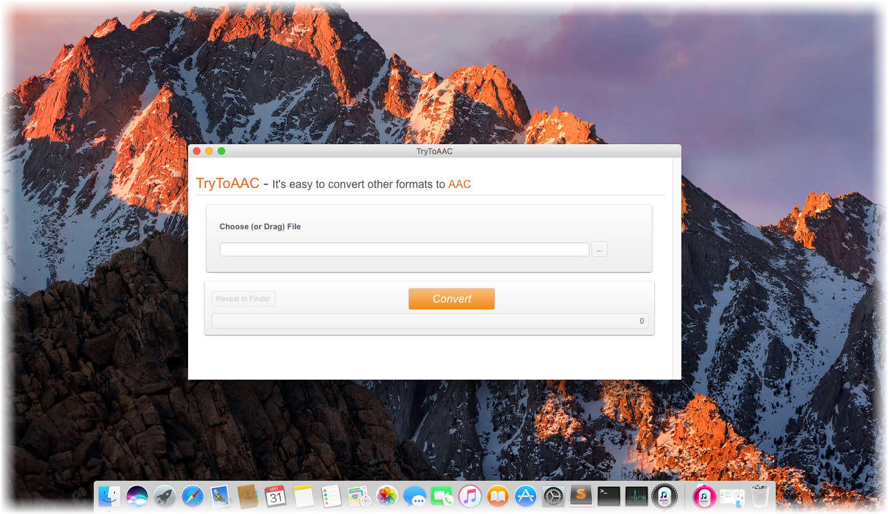

layout: app
title: TryToAAC-a streamlined AAC audio file converter on Mac
subtitle: TryToAAC
comments: false
current: index
keywords: aac converter on mac, aac converter software mac, mac mp3 to aac converter, mac mp4 to aac converter, convert flac to aac on mac, convert mp3 to aac mac 
description: TryToAAC is a minimum converter that easily convert various audio formats to AAC file on Mac OS X.
---

## OVERVIEW

**TryToAAC** is a minimum and streamlined AAC converter that easily convert some of the most popular audio standards out there to the AAC format, for example, convert MP3 to AAC, MP4 to AAC, and FLAC to AAC, etc. It is designed for Mac users only. The software can intelligently recognize an extensive number of audio formats and convert them to AAC files quickly, regardless of the model, manufacture, or operating system. Without log in and registration, or any plug-in, you can enjoy simple, swift and free listening experience anytime and everywhere. It is a simple audio converter that helps you make tracks compatible with many devices. Just have a try.

 

<h3>Price: $19.99 
</h3>
 

 

## USE CASES: BUILT FOR YOU
TryToAAC aims to satisfy various requirements for different users on Mac. Fans of Apple products must be familiar with AAC audio format, for Apple pioneered its development. Later, more and more devices support AAC format, and it is recognized as the successor of MP3. Besides, AAC enjoys its popularity in streaming TV and radio broadcast, because its high-quality and less bandwidth. Through this converter, users are able to convert any other audio files to AAC format, and thus enjoy a better listening quality.

1. **Apple Fans**: Apple has long been the main supporter of AAC format. AAC has been used by iTunes store since its inception, and is currently used by Apple Music. It is also the native file format for iTunes. Compared to MP3, AAC is generally slightly smaller, and sounds slightly better. It is compatible with iPad, iPhone, Macbooks and of course, tiny iPod. It is undoubted that a true Apple fan favor AAC for their digital music.
 

 
 
1. **Users for Non-Apple Devices**: In fact, AAC was not created by Apple and is not a proprietary Apple format. While AAC is slightly less widely supported than MP3, virtually any modern media device can use it. For example, Sony Walkman, Amazon Music, Unlimited, Nintento, Deezer, Microsoft Zune, and mobile phones running Google's Android OS, etc. 
 

 
1. **Users for Streaming TV or Radio Broadcast**: AAC is the hottest format which was widely applied in the streaming TV and also radio broadcast. As a more advanced audio file, AAC is actually much more efficient as it takes up even less bandwidth than the MP3 while doing less harm to the audio quality. For example, iHeartRadio, YouTube, etc.
 

 

