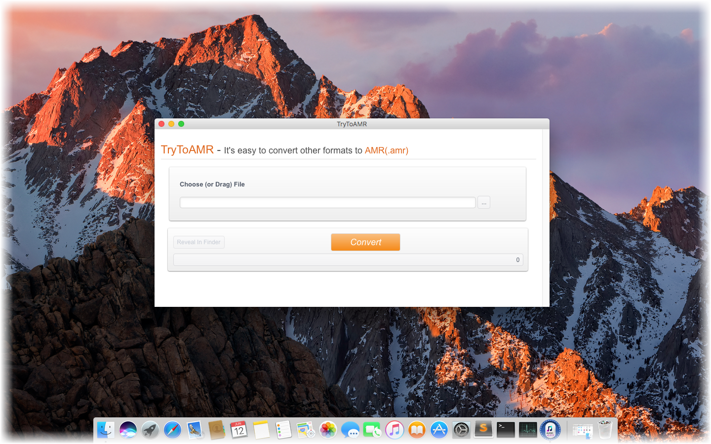

layout: app
title: TryToAMR-a streamlined AMR audio file converter on Mac
subtitle: TryToAMR
comments: false
current: index
keywords: amr converter on mac, amr converter software mac, mp3 to amr converter mac, mac mp4 to amr converter, convert flac to amr on mac, convert mp3 to amr on mac
description: TryToAMR is a minimum converter that easily convert various audio formats to AMR file on Mac.
---

## OVERVIEW

**TryToAMR** is a minimum and streamlined AMR converter that easily convert some of the most popular audio standards out there to the AMR format, for example MP3 to AMR, MP4 to AMR, FLAC to AMR, etc. The software can intelligently recognize an extensive number of audio formats and transform them to AMR files quickly, regardless of the model, manufacture, or operating system. Without log in and registration, or any plug-in, you can enjoy simple, swift and free listening experience anytime and everywhere. It is a simple audio converter that helps you make tracks compatible with many devices. Just have a try.

Learn more [about TryToAMR](./features.html).

 

<!--  -->

 
## USE CASES: BUILT FOR YOU
TryToAMR aims to satisfy various requirements for different users. Through this converter, users are able to convert any other audio files to AMR format, and thus enjoy a better listening quality.

1. **Users Who Willing to Store Spoken Audios**: If users have to store some important spoken audios or records, AMR codec would be an excellent choice for you. Besides, many modern mobile telephone handsets can store short audio recordings in the AMR format, and both free and proprietary programs exist to convert between this and other formats.
 

 
 
1. **MMS Users**: The AMR audio files is much smaller than most audio formats. Therefore, AMR format is suitable to be used as multimedia message service (MMS). What's more, you can record your own voice and use it directly as a multimedia message and ringtones. Because AMR is the only audio format that can load human voices in MMS.
 

 
1. **Users for mobile devices**: Most multimedias in mobile devices, especially audio and video players, are all support AMR. For example: windows media player, Realone, AMR Player, StormPlayer, etc. 
 

 

  