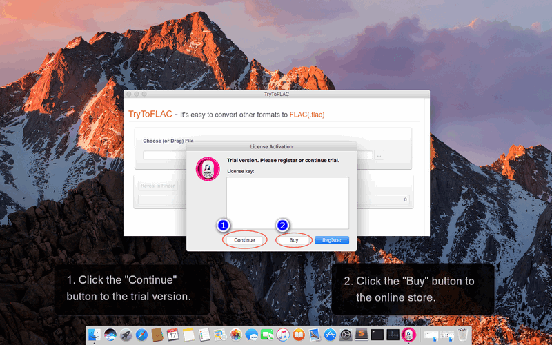
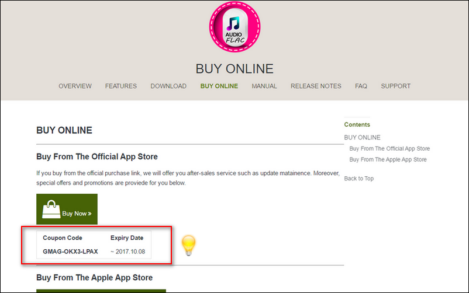
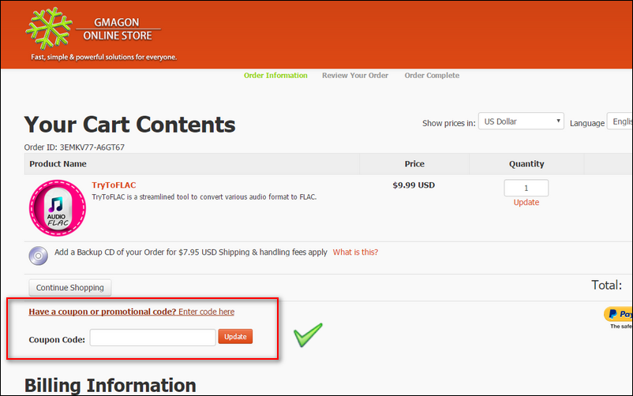
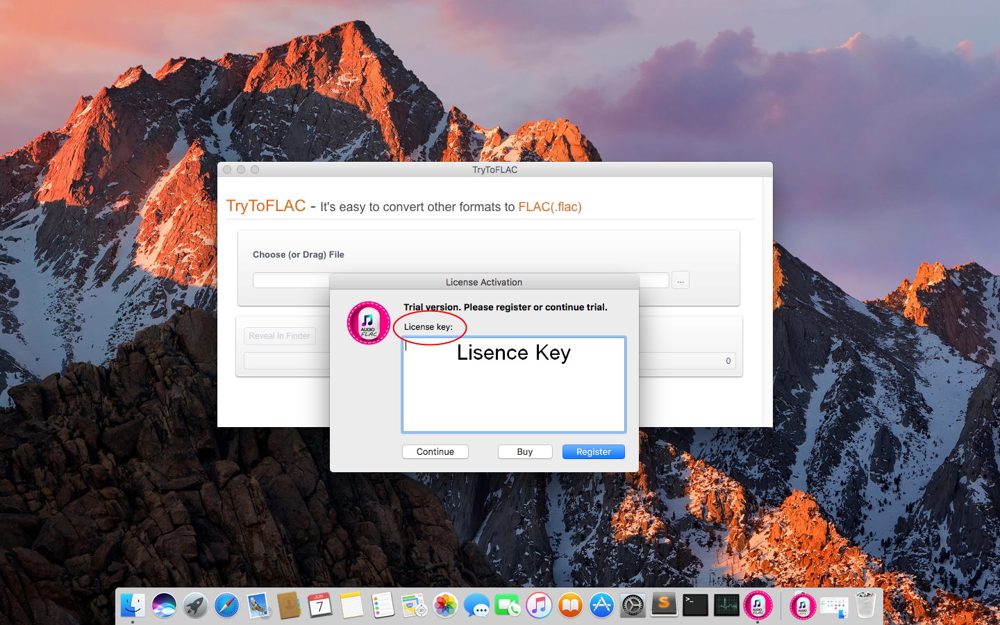

layout: app
title: Manual | TryToFLAC
subtitle: Documentation
comments: false
product: TryToFLAC
current: docs
---

# MANUAL
## TryToFLAC
An FLAC audio converter for Mac

Version 4.0

 

 ### **Preface**:

>Do you think MP3 audio files cannot fit your desire for music?

>Do you enjoy high-quality audio file and better listening experience?

>Have you got into trouble when you put other audio formats into your player?

  If you answered "yes" to at least one of these questions, then TryToFLAC is definitely designed for you. If you are interested to know more about this product, and how the product can help you in your life, just read more below, and have a try, you can simply enjoy the excellent user experience by our company.

 
 ### **Introduction**:
FLAC, which stands for Free Lossless Audio Codec, an audio format similar to MP3, but lossless, meaning that audio is compressed in FLAC without any loss in quality. This is similar to how Zip works, except with FLAC you will get much better compression because it is designed specifically for audio, and you can play back compressed FLAC files in your favorite player just like you would an MP3 file, such as your home stereo, your car or your phones. This converter lets you also easily extract audio from video files in high quality.

TryToFLAC is an FLAC audio converter tool which aims to convert various audio formats to the FLAC format. The software is made for Mac users only (MacOSX 10.7 mac OS (64-bit) or newer is required). The software is so convenient that users can easily get the conversion result by simply clicking one button in it. Most audio formats in Internet can be intelligently recognized by TryToFLAC and transfered as FLAC format. The conversion process in our product is simple and efficient, users will be released from annoying ads, bundled softwares, plug-ins, even log in and registration. By simply enjoying the swift, comfortable operation of TryToFLAC, you are able to join our community and get our excellent after-sale services.  

 
### **Installation**:
TryToFLAC runs on Mac only, MacOSX 10.7 mac OS (64-bit) or newer is required. A new version 4.0 is updated recently. Older version is also provided in Older Releases in [DOWNLOAD](./download.html). 

There are three kinds of install package in DOWNLOAD page, you need to choose one suitable package, click it and wait for the downloading. Then choose a suitable folder to put the software in and click "open" to run it.   

**The trial version** for users is also available in [DOWNLOAD](./download.html), and combined with the install package.

 You can click and download one of the files. when you open and run the software, a little window will pop up. If you choose to try out, click "continue" button, you can freely try this software three times. If you wanna to buy our product, then click "Buy" button to enter the online store. 

 

If you encounter any problems during or after installing TryToFLAC please refer to [Frequently Asked Questions (FAQ)](./faq.html) first.

 
### **User Guide**:
This section describes daily use guide to the TryToFLAC client. It instructs you how to use the software in details after the installation finished.
1. Firstly, you need to open the file and run it, the window of TryToFLAC will pop up in the desktop. As what have mentioned before, if you want to try out this software first, click "continue" to use the trial version, you have three chances to try it freely. If you satisfied with our product,and decided to pay for it, please click the "Buy" button or directly come to our home page and enter the [BUY ONLINE](./buy.html).
 
2. Secondly, in the BUY ONLINE page, there are two optional purchase link for you, that is, you can choose to buy from our **official App store** or the Apple App store. The good news is, we offer a **coupon code** below the purchase link for anyone who willing to buy from the Gmagon official App store. 
 
 
 
3. Thirdly, in the Gmagon Online Store, you need to put the product in your cart, fill the Billing Information, choose your payment information, and then finish the whole purchase process.
 
 
 
4. Finally, after you finished the purchasing process of the product, you can get the **active code** from us. When you run the software, a registered window will pop up, then you need to copy and paste the active code in the **license key** text box, then click "register" button to finish the License Activation.
 
  
 
Hope the TryToFLAC will help you enjoy a high-quality listening experience and make your life more convenient than ever. We'd like to receive and answer any question from you, if you are willing to communicate with us in <a href="https://gitter.im/Gmagon/support" target="_blank" rel="nofollow me noopener noreferrer"> <strong>Support Center</strong> </a> and join our community. We will strive to provide the best services we can offer with our customers. 
