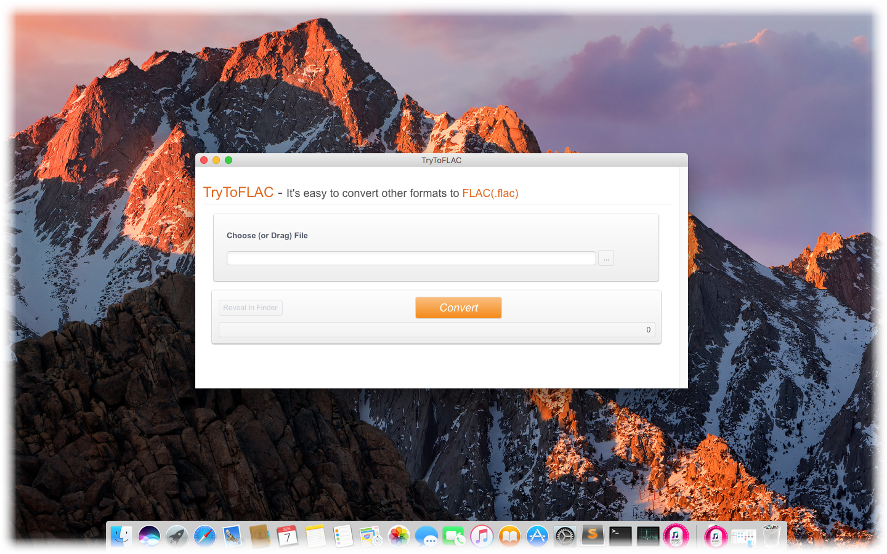
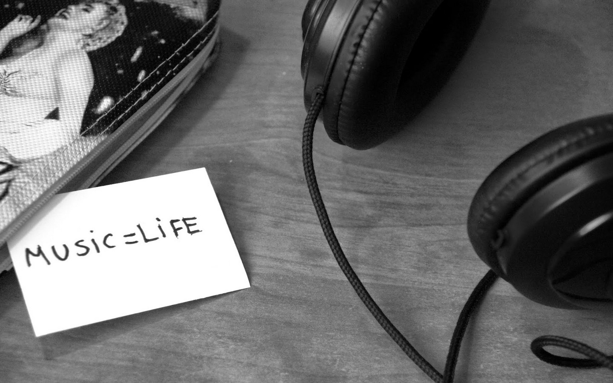
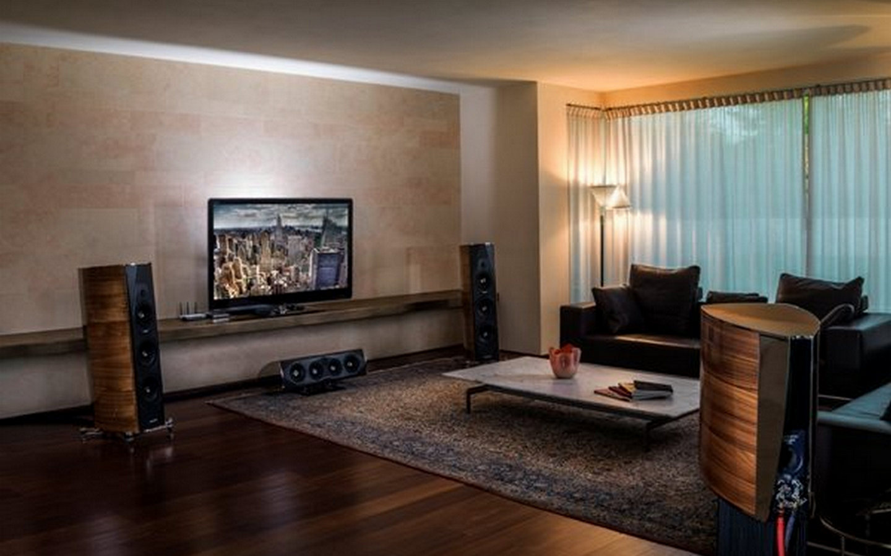
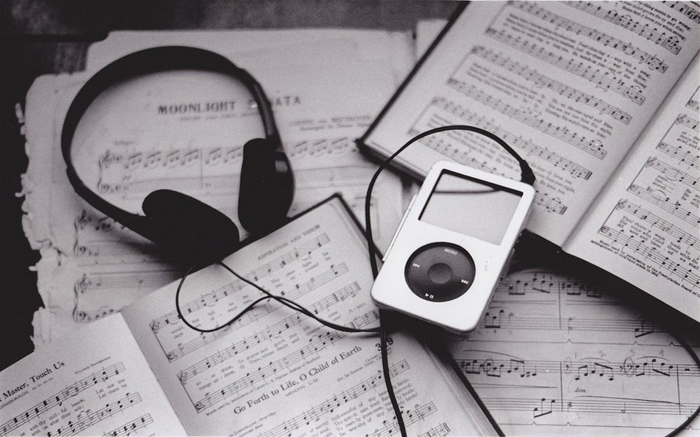

layout: app
title: TryToFLAC-a streamlined FLAC audio file converter on Mac
subtitle: TryToFLAC
comments: false
current: index
keywords:  flac converter on mac, flac converter software mac, mp3 to flac converter, mp4 to flac converter, convert amr to flac, convert mp3 to flac 
description: TryToFLAC is a minimum converter that easily convert various audio formats to FLAC file.
---

## OVERVIEW

**TryToFLAC** is a minimum and streamlined FLAC converter that easily convert some of the most popular audio standards out there to the FLAC format, for example, convert MP3 to FLAC, MP4 to FLAC, WMA to FLAC, etc. The software can intelligently recognize an extensive number of audio formats and convert them to FLAC files quickly, and also let you easily extract audio from video files in high quality. Without log in and registration, or any plug-in, you can enjoy simple, swift and free listening experience anytime and everywhere. It is a simple audio converter that helps you make tracks compatible with many devices. Just have a try.

Learn more [about TryToFLAC](./features.html).

 

 
## USE CASES: BUILT FOR YOU
TryToFLAC aims to satisfy various requirements for different users. FLAC is a free lossless compressed audio format that offers bit-perfect copies of CDs but at half the size. It is similar to MP3, but possesses much higher audio quality. For music buffs, music sound quality is of great importance. As a lossless audio codec, FLAC is able to provide you a better listening experience. For home stereo users, many brands and devices support the FLAC format. For people who like enjoying music in their cars, FLAC also is supported by some car audios. Portable devices, such as MP3-players, MP4-players, mobile phones have adopted FLAC audio format. This converter lets you also easily extract audio from video files in high quality.

1. **Music Buffs**: A music buff cannot live without it. Quality of music is of great significance, musics of poor quality is unbearable. FLAC, as a lossless compression of digital audio, delivers much higher quality than other loss formats like MP3, WMA, but reduces almost half size of a CD-quality file.
 

 
 
1. **Home Stereo Users**: Imagining you are sitting in the coach of your living room after all-day work surrounded by wonderful musics, you can indulge yourself in the sea of haunting melodies without any disturb from outside. How wonderful it could be. You only need a fine audio format to reach the effect. Do not hesitate, TryToFLAC will help you to reach what you want easily by clicking a single button.
 

 
1. **Users for Car Audio**: Driving sometimes is an exhausting and boring activity for people who drives. If some sound melodies come out from the car audio devices, that would give drivers a clear head, and refresh themselves. Fine audios probably helps to reduce their tiredness or even accidents. 
 

 
1. **Portable Device Users**: It is undoubted that portable devices possess many advantages than those ponderous devices. When you use portable devices playing FLAC audio files, you are able to enjoy sound and higher audio quality anytime and everywhere. For example, mobile phones including both Android and Apple, MP3-players, MP4-players,etc. 
 

 