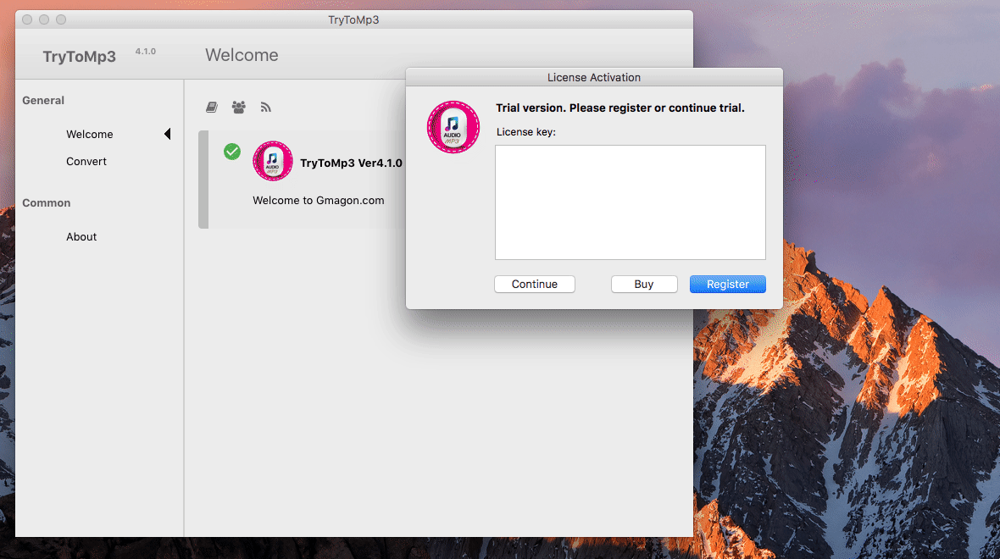

layout: app
title: TryToMP3-convert any video/audio files to MP3 on Mac
subtitle: TryToMP3
comments: false
current: index
keywords: mp3 converter on mac, convert to mp3 on mac, any audio to mp3 converter mac, mac mp3 music converter, convert any video to mp3 on mac
description: TryToMP3 helps users convert a set of video and audio files to MP3 format on Mac quickly and easily.  
---

## OVERVIEW

**TryToMP3** is a Mac MP3 music converter. It is capable of converting audio files in various formats to MP3 format, for example, converting AAC to MP3, converting FLAC to MP3, converting AC3 to MP3, converting M4A to MP3 and more. Plus, our app allows you to extrat an audio track from a video and save it as MP3. This feature is useful when you want to save a particular song from a movie or a music video. 

This any video/audio to MP3 converter for Mac works with almost all video and audio formats and can convert multiple files simultaneously in a batch, saving them in the widely-accepted MP3 format. Just try it!

 

<h3>Price: $19.99 
</h3>
 

 

## USE CASES: BUILT FOR YOU
TryToMP3 delivers high-quality MP3 format designed for every kind of Mac users. MP3-player users are able to keep their devices without concerns. Avid movie goers get a well-content tool to aftertaste memorable movie lines. As a voice fetish, you can easily get your favorite voice from TryToMP3. Listening is a key to learn foreign languages, TryToMP3 will be a good helper for you to learn a new language.

1. **MP3-player Users**: Heard the recent stories that MP3 has been killed? Wondered whether throw away the MP3-player you just bought last month or not?Please show mercy! Maybe it’s time for you to try this software to save MP3. At least, your MP3-player is not dead at all.

 

1. **Avid Movie Goers**: Can’t help to hear wonderful music in movies again? The dialogue is so interesting or profound that revolves in your hand? Why not try to convert such videos to MP3 format, so that you can listen freely your favorite part whenever you want.

 
1. **Voice Fetish**: Deep and low-pitched voices are always attracting, especially for girls. Do you feel a chill up and down your spine when you hear the voice of Benedict Cumberbatch? If yes, our product is definitely designed for you.

 
1. **Foreign Language Learners**: Recited a large amount of vocabularies, but still cannot understand a word when foreigners talking to you. You need to change the way of study. Keep on listening is crucial for learning a language. TryToMP3 may help you save a lot of money from language institutions.

