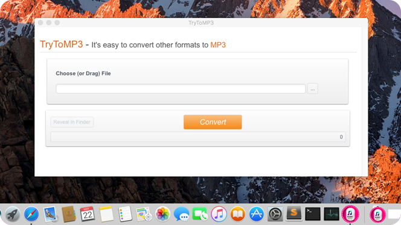

layout: app
title: TryToMP3
subtitle: TryToMP3
comments: false
current: index
---

## OVERVIEW

**TryToMP3** is an audio converter which runs on Mac. It aims to convert various audio formats to MP3 for users. The software can intelligently recognize most audio formats and transfer it to MP3 quickly. Without log in and registration, or any plug-in, you can enjoy simple, swift and free listening experience anytime and everywhere. Just try it!

Learn more [about TryToMP3](./features.html).

<a href="./download.html"><i class="fa fa-download fa-3x" aria-hidden="true"></i>  Download </a>
 

<!--  -->

## USE CASES: BUILT FOR YOU
TryToMP3 delivers high-quality MP3 format designed for every kind of Mac users. Users for MP3-players are able to keep their devices without concerns. Avid movie goers get a well-content tool to aftertaste memorable movie lines. As a voice fetish, you can easily get your favorite voice from TryToMP3. Listening is a key to learn foreign languages, TryToMP3 will be a good helper for you to learn a new language.

1. **MP3-player Users**: Heard the recent stories that MP3 has been killed? Wondered whether throw away the MP3-player you just bought last month or not? Please show mercy! Maybe it’s time for you to try this software to save MP3. At least, your MP3-player is not dead at all. 

 

1. **Avid Movie Goers**: Can’t help to hear wonderful music in movies again? The dialogue is so interesting or profound that revolves in your hand? Why not try to convert such videos to MP3 format, so that you can listen freely your favorite part whenever you want. 

 

1. **Voice Fetish**: Deep and low-pitched voices are always attracting, especially for girls. Do you feel a chill up and down your spine when you hear the voice of Benedict Cumberbatch? If yes, our product is definitely designed for you.  

 

1. **Foreign Language Learners**: Recited a large amount of vocabularies, but still cannot understand a word when foreigners talking to you. You need to change the way of study. Keep on listening is crucial for learning a language. TryToMP3 may help you save a lot of money from language institutions.     

