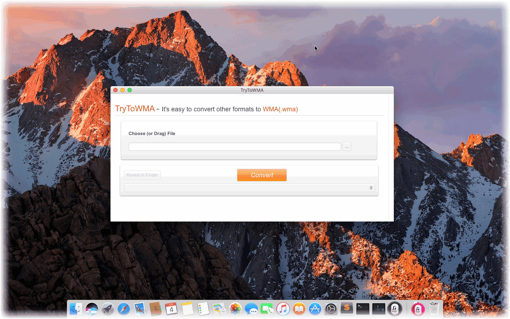

layout: app
title: TryToWMA-a streamlined WMA audio file converter on Mac
subtitle: TryToWMA
comments: false
current: index
keywords: wma converter on mac, convert to wma mac, mac wma converter download, mp4 to wma converter mac, mac wma music converter, convert mp4 to wma on mac
description: TryToWMA is a minimum converter that easily converts various audio formats to WMA files on Mac.
---

## OVERVIEW

**TryToWMA** is a minimum and streamlined WMA converter that easily convert some of the most popular audio standards out there to the WMA format, for example, to convert MP3 to WMA, MP4 to WMA, AAC to WMA, etc. The software can intelligently recognize an extensive number of audio formats and convert them to WMA files quickly, regardless of the model, manufacture, or operating system. Without log in and registration, or any plug-in, you can enjoy simple, swift and free listening experience anytime and everywhere. It is a simple audio converter that helps you make tracks compatible with many devices. Just have a try.
 
 

<h3>Price: $19.99 
</h3>
 

 
## USE CASES: BUILT FOR YOU
TryToWMA delivers high-quality WMA format and is designed for every kind of Mac users. WMA fits Mac devices and most popular media players. Users for MP3-players are able to use WMA to save much more room than MP3 format with similar audio quality. Apple users also can use WMA format freely in their iTunes. Other users are able to convert other formats to WMA file so as to save much more room while maintaining unchanged audio quality. 

1. **MP3-player Users**: Most users for tiny, portable MP3-players are likely to face a dilemma which the storage space is so limited that you cannot store enough audio files as you wish. As a conceived competitor to the popular MP3, WMA enjoys its superiority. For WMA could produce files that were half the size of equivalent-quality MP3 files, it is also praised as "near CD-quality" audio. In short, WMA was intended to address perceived deficiencies in the MP3 standard. So users can use smaller WMA files to replace MP3 files.
 

 
1. **Apple Users**: Though WMA is a proprietary technology that is designed by Microsoft and forms part of the Windows Media framework, it can also be used in Apple devices. Because iTunes of Apple has been supported WMA for a long time, and makes it as popular as MP3 format. So Apple devices including iPhone, iPad, iPod, and Macbook all support WMA file and Apple users can feel free to convert other formats to WMA format.
 

 

1. **Network Streaming and Mobile Devices**: Audio files that are produced by WMA account for half the size of MP3 at the premise of equivalent audio quality. It means that the number of stored audio files doubled with the same storage space, and it will not damage the audio quality. Therefore, WMA files is suitable for network media players and mobile devices. For example, ALLPlayer, VLC media player, Media Player Classic, MPlayer, RealPlayer, Winamp Zune Software, etc.  
 

 