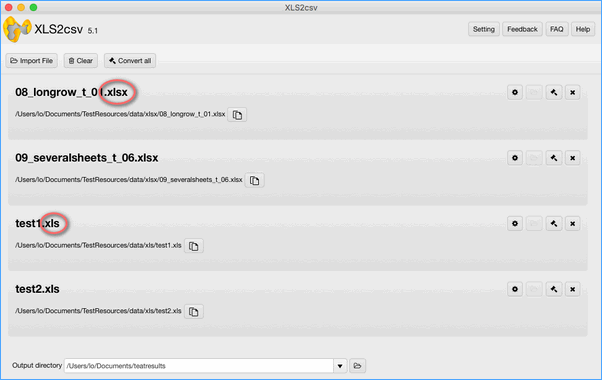
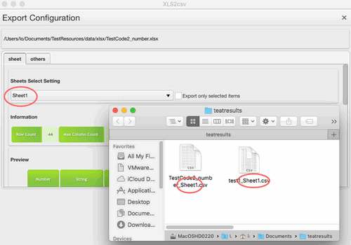
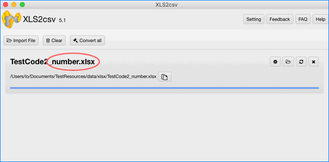
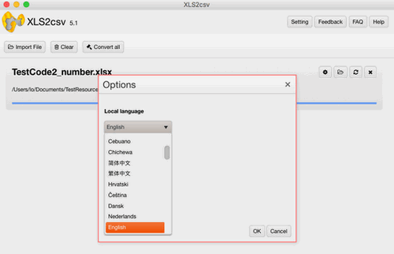
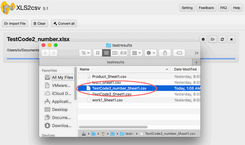

layout: app
title: XLS2csv Release Notes

subtitle: Release Notes
comments: false
current: changelog
---

## Version 5.1 
Release date: 2017-08-23

 
### .xls to .csv part
> * Fix Memory overflow exception
* Fix the size of file parsing and bumper
* Fix the problem of default CSV field separator
* Delete the character of CSV field surrended by ""
* Support converting large .xls files
* Support generating the name of CSV file according to the number of Sheet.
 

 
### .xlsx to .csv part
> * Support .xlsx files (Microsoft Excel, Apple Numbers, Open Offices Excel)
* Support parsing section of data format conversion
* Support data format of WPS: 
               1. WPS [176] Fraction expression format [#\ ?/?].  
               2. WPS [177] Common string format [0_ ]
               3. WPS [178] Date time format [yyyy/m/d;@]
               4. WPS [179] Date time format [[$-409]h:mm:ss\ AM/PM;@]
               5. WPS [180] Common format coding [[DBNum1][$-804]General]
* Support data format of Common built-in format: 
               1. built-in format style of parsing date
               2. built-in format style of variable reference
               3. built-in format style of parsing fraction
               4. built-in format style of parsing scientific counting expression
               5. built-in format style of parsing percentage
               6. built-in format style of parsing time
               7. built-in format style of parsing currency        
* Support data format of Apple Numbers:

               1. Numbers [59] 0" "
               2. Numbers [60] yyyy/m/d
               3. Numbers [61] "￥"#,##0.00;"￥-"#,##0.00
               4. Numbers [62]  h:mm:ss" "AM/PM
               5. Numbers [63] # #/#
* Support extraction of table data attributes:  
          title
          subject
          author
          keywords
          comment
          lastAuthor
          appName
          category
          manager
          company
* Support table preview and data extraction
* Support large .xlsx files procession
* Generate the name of CSV file according to the number of Sheet.

 
### User Interface part 
> * Setting-adjust background of language interface

* Adjust the Hover status of all buttons
* Accurately locate output path after successfully converting .xls/.xlsx files
  

 
### Core Engine part
> Upgraded to Ver1.14

 
### Version 5.0 (release date: 2017-07-23)
- Upgraded core API.
- Redesigned software logo.

 
### Download
for macOS 64-bit OS | FileSize
------------------------------ | -------------------------
[Download XLS2csv-v5.1.dmg](http://www.filefactory.com/file/3erf0icxce6r/XLS2csv-5.1.dmg)    | (~10.52MiB)
[Download XLS2csv-5.1.zip](http://www.filefactory.com/file/29qg8m1099l3/XLS2csv-5.1.zip)    | (~10.74MiB)
---
