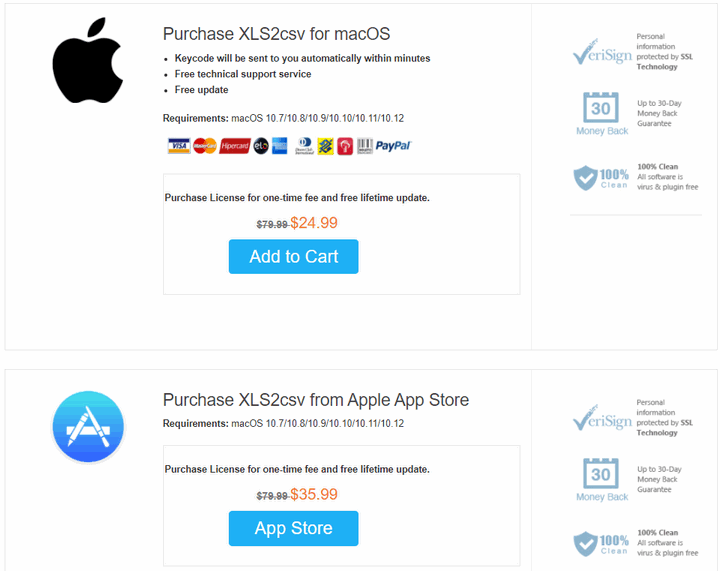
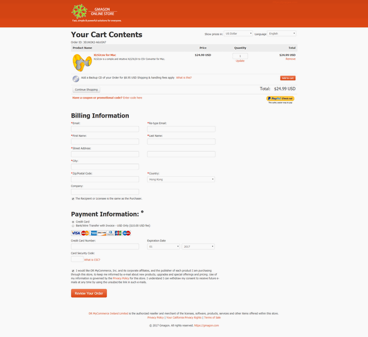

layout: app
title: XLS2csv User Manual
subtitle: Documentation
comments: false
product: XLS2csv
current: docs
---

# MANUAL
## XLS2csv
XLS/XLSX to CSV Converter app for Mac OS X

Version 5.1

 

 ### **Preface**:

>Are you trying to improve your working efficiency?

>Need to handle large XLS or XLSX files on you Mac?

>Want to change Excel spreadsheets into plain text CSV?

If your answer is yes, XLS2csv is what you need.

 
### **Introduction**: 
XLS is the default file format for the 2003 version of Excel and older while XLSX for versions since 2007. XLS is based on BIFF (Binary Interchange File Format) and as such, the information is directly stored to a binary format. On the other hand, XLSX is based on the Office Open XML format, a file format that was derived from XML. The information in an XLSX file is stored in a text file that uses XML to define all its parameters.

CSV files hold plain text as a series of values (cells) separated by commas (,) in a series of lines (rows). You can actually open a CSV file in a text editor and read it yourself. Many applications are capable of reading CSV files, and many languages provide built-in functions that simplify reading/writing CSV format.

XLS2csv is a file converter which tends to convert XLS/XLSX files to CSV format. With it installed, you can not only do file conversion but also join our community and get our excellent after-sale services. No annoying ads, bundled software and plug-ins will be added onto your Mac. 

 
### **Installation**:
XLS2csv runs on Mac only, Mac OS X 10.7(64-bit) or above is required. The new version 5.1 is now released on our [DOWNLOAD page](./download.html). You can choose to download the .zip or .dmg package. When you open and run the software, the product interface will pop up. The following "User Guide" will instruct you how to use it. 

 Once you run the software, a little window will pop up as below. If you choose to try it out, click "continue" button, you can try it for free 30 days. If you want to buy our product, click "Buy" button to enter the online store. 

 

If you encounter any problems during or after installing XLS2csv, please refer to [Frequently Asked Questions (FAQ)](./faq.html) first.

 
### **User Guide**:
This section instructs you how to purchase and run XLS2csv in detail. 

1. Firstly, run XLS2csv on your desktop. As what have mentioned before, if you want to try it out, simply click "continue". The free trial version will stop working after 30 days. If you are satisfied with our product, and decide to pay for it, please click the "Buy" button or directly go to our [BUY ONLINE](./buy.html).
 
2. Secondly, in the BUY ONLINE page, there are two optional purchase link for you, that is, you can choose to buy from our Gmagon online store or the Apple App store. 
 
 
3. Thirdly, in the Gmagon Online Store, you need to put the product in your cart, fill the Billing Information, choose your payment information, and finish the whole purchase process.
  
 
4. Finally, after you finished the purchasing process, you can get the **active code** from us. When you run the software, a registered window will pop up, then you need to copy and paste the active code in the **license key** text box, then click "register" button to finish the License Activation.
  

Hope Gmagon XLS2csv will help you enjoy a high-quality user experience and make your life more convenient than ever. We'd like to receive and answer any question from you, if you are willing to communicate with us in <a href="https://gitter.im/Gmagon/support" target="_blank" rel="nofollow me noopener noreferrer"> <strong>Support Center</strong> </a> and join our community. We will strive to provide the best services we can offer with our customers. 

**Learn more**
- [How to convert XLS to CSV on a Mac? ](../../../guide/convert-xls-to-csv-on-mac.html)
- [How to convert a .xlsx file to .csv on Mac?](../../../guide/how-to-convert-a-xlsx-file-to-csv-on-mac.html)
- [CSV UTF8 - Excel XLS to CSV with UTF-8 encoding ](../../../guide/xls2csv/csv-utf8.html)

