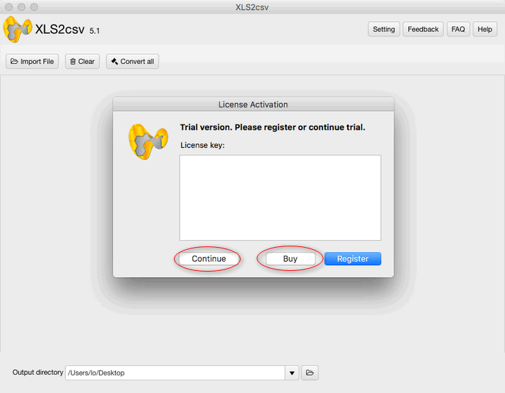
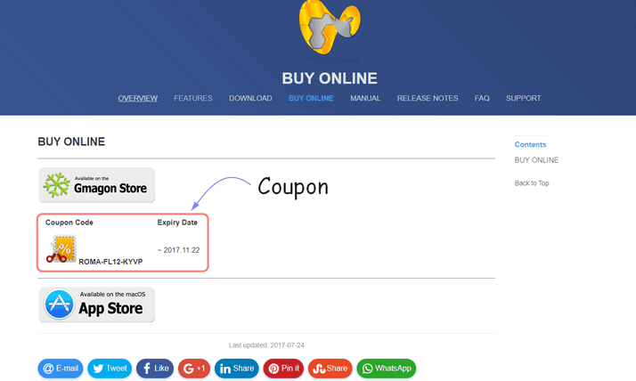
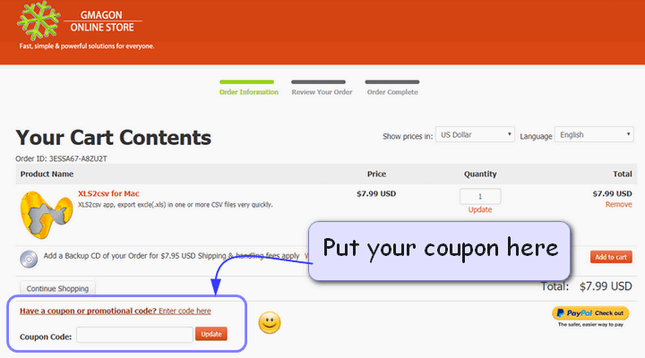
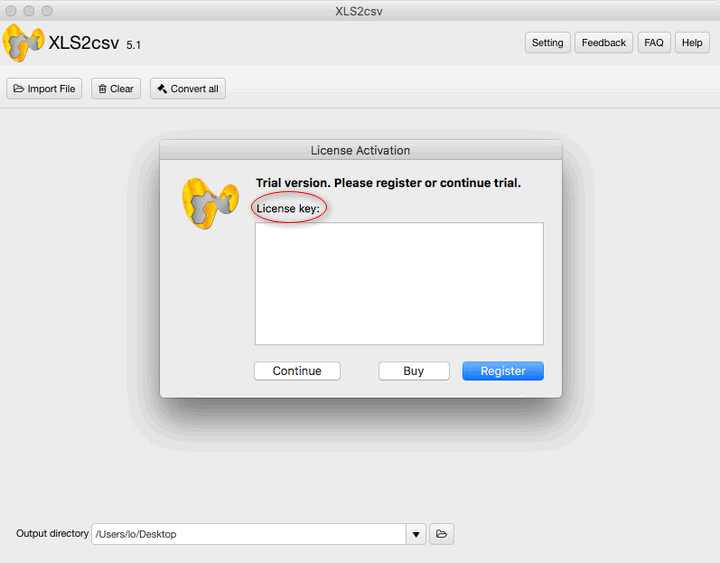

layout: app
title: Manual | XLS2csv
subtitle: Documentation
comments: false
product: XLS2csv
current: docs
---

# MANUAL
## XLS2csv
An APNG converter tool for **macOS**

Version 5.0

 

 ### **Preface**:

>Are you thrive to improve your working efficiency?

>Have you need your XLS files be interpreted quickly?

>Do you need to make your data to be saved in a table structured format?

If you answer yes to one of these questions, the XLS2csv is the best choice for you.

 
### **Introduction**: 
XLS is a MS Excel workbook binary file, which holds information about all the worksheets in a workbook, comprising both content and formatting (number masking, colouring, conditional formatting, etc), and it can also hold additionals like charts, images, etc. XLS files can only be read by applications that have been especially written to read their format, and can only be written in the same way.

A CSV file is a way to collect the data from any table so that it can be conveyed as input to another table-oriented application such as a relational database application. Microsoft Excel, a leading spreadsheet or relational database application, can read CSV files. A CSV file is sometimes referred to as a flat file.

XLS2csv is an image format converter which tends to convert XLS to CSV format. The software is made for Mac users only (**macOS 10.7(64-bit)** or newer is required). Users will be released from annoying ads, bundled softwares, plug-ins, even log in and registration. By simply enjoying the swift, comfortable operation of XLS2csv, you are able to join our community and get our excellent after-sale services.  

 
### **Installation**:
XLS2csv runs on Mac only, MacOS 10.7(64-bit) or newer is required. The new version 5.0 is released now in [DOWNLOAD](./download.html). 

There are two kinds of install package in [DOWNLOAD](./download.html) page, you need to choose one suitable package, click it and wait for the downloading. Then choose a suitable folder to put the software in and click "open" to run it.   

When you open and run the software, the product interface will pop up. The following "User Guide" will instruct you how to operate it. 

If you encounter any problems during or after installing XLS2csv please refer to [Frequently Asked Questions (FAQ)](./faq.html) first.

**The trial version** for users to try out is also available in [DOWNLOAD](./download.html), and combined with the install package.

 You can click and download one of the files. When you open and run the software, a little window will pop up. If you choose to try out, click "continue" button, you can freely try this software three times. If you wanna to buy our product, then click "Buy" button to enter the online store. 

 

If you encounter any problems during or after installing XLS2csv please refer to [Frequently Asked Questions (FAQ)](./faq.html) first.

 
### **User Guide**:
This section describes daily use guide to the XLS2csv clients. It instructs you how to use the software in details after the installation finished.

1. Firstly, you need to open the file and run it, the window of XLS2csv will pop up in the desktop. As what have mentioned before, if you want to try out this software first, click "continue" to use the trial version, you have three times to try it freely. If you satisfied with our product,and decided to pay for it, please click the "Buy" button or directly come to our home page and enter the [BUY ONLINE](./buy.html)
 
2. Secondly, in the BUY ONLINE page, there are two optional purchase link for you, that is, you can choose to buy from our **official App store** or the Apple App store. The good news is, we offer a **coupon code** below the purchase link for anyone who is willing to buy from the Gmagon official App store. 
 
 
 
3. Thirdly, in the Gmagon Online Store, you need to put the product in your cart, fill the Billing Information, choose your payment information, and finish the whole purchase process.
 
 
 
4. Finally, after you finish the purchasing process of the product, you can get the **active code** from us. When you run the software, a registered window will pop up, then you need to copy and paste the active code in the **license key** text box, then click "register" button to finish the License Activation.
 
  
 
Hope the XLS2csv will help you enjoy a high-quality user experience and make your life more convenient than ever. We'd like to receive and answer any question from you, if you are willing to communicate with us in <a href="https://gitter.im/Gmagon/support" target="_blank" rel="nofollow me noopener noreferrer"> <strong>Support Center</strong> </a> and join our community. We will strive to provide the best services we can offer with our customers. 
