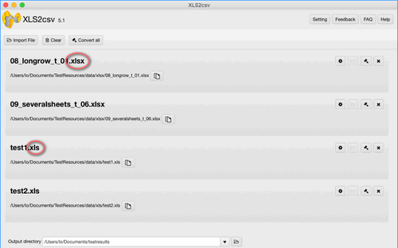
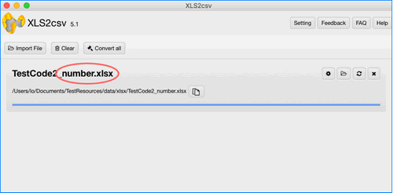
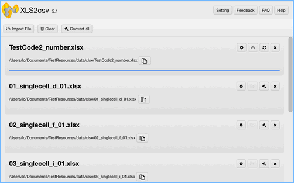
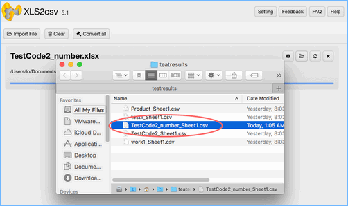

layout: app
title: XLS2csv Key Features 
subtitle: Features
comments: false
current: features
---

## FEATURES
- Support XLS/XLSX to CSV

- Support WPS format
- Support large XLS/XLSX files procession
- Support built-in format
- Support characters of Numbers

- Support drag and drop files
- Convert all with one click
- Support batch conversion

- Built for Mac users only
- Fool-style operation
- Support preview before conversion
- Support data extraction
- Support various encoding and separator
- Show up generated file in finder after conversion

- After-sale services
- Intuitive interface and fast conversion speed
- No ads and plug-ins
- The free trial version will stop working after 30 days

 

