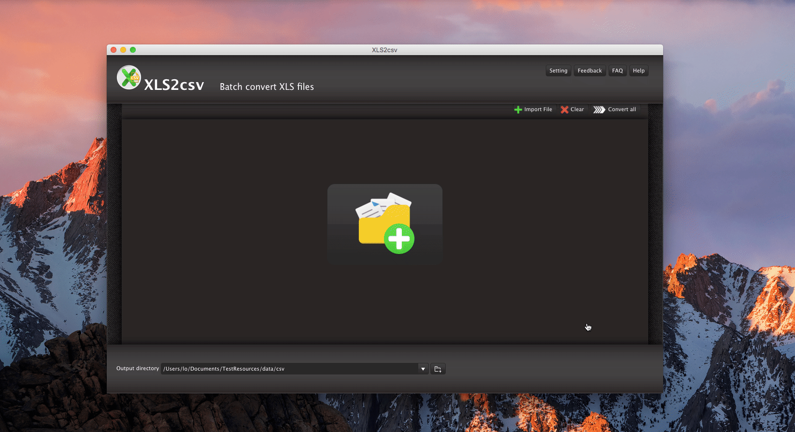

layout: app
title: XLS2csv
subtitle: XLS2csv
comments: false
current: index
---

## OVERVIEW

**XLS2csv** is a streamlined file converter that easily converts the XLS format out there to the CSV. The software can intelligently recognize XLS files or directory and transform them to CSV files quickly. Users are allowed to drag and drop a file or directory to the interface of XLS2csv, and preview the conversion results before the conversion finished. By clicking Setting button, users can set up their preferable language of the tool. Besides, there are Feedback, FAQ and Help choices for users' convenience in case any problems occurred during users' experience.

XLS2csv fits into any budget and grows with your needs. Try the XLS2csv now and see how it can make your job easier. Everything you need is contained in one simple installer, no additional downloads or plug-ins are required. We make it simple for you, now and later!

Learn more [about XLS2csv](./features.html).

 

 

## USE CASES: BUILT FOR YOU
 XLS is an MS Excel workbook binary file, which holds information about all the worksheets in a workbook, and can also hold additionals like charts, images, etc. XLS files can only be read by applications that have been especially written to read their format, and can only be written in the same way. Pre-2007 versions of Excel use XLS as the primary format for saving files. It features calculation, graphing tools, pivot tables, and a macro programming language called Visual Basic for Applications. It has been a very widely applied spreadsheet for these platforms 

A CSV is a comma separated values file which allows data to be saved in a table structured format. CSV files can be used with any spreadsheet program, such as Microsoft Excel, Open Office Calc, or Google Spreadsheets. They differ from other spreadsheet file types in that you can only have a single sheet in a file, they can not save cell, column, or row styling, and can not save formulas. In ecommerce, CSVs are used primarily for importing and exporting product, customer, and order information to and from your store:

1. **Importing and Exporting Products**: Importing your products is the fastest way to create or update products in bulk. A product import involves having all of your product information in a CSV file, which can be edited as a spreadsheet. Upon import, your column headers will be matched with their corresponding product, and the product information will be updated accordingly. Importing products has a variety of uses, such as updating products, creating new products and options, etc. 

 
2. **Importing Product Options**: Importing your options is an efficient way to handle the sometimes lengthy task of adding product options to each of your products. The following guide walks you through creating Product Options by importing a CSV file file. 

 
 3. **Importing Customers**: Importing your customers is the fastest way to add or update their information in bulk. A customer import involves having all of your customer information in a CSV file, which can be edited as a spreadsheet. Upon import, your column headers will be matched with their corresponding customer fields in BigCommerce, and the customer information will be updated accordingly.
