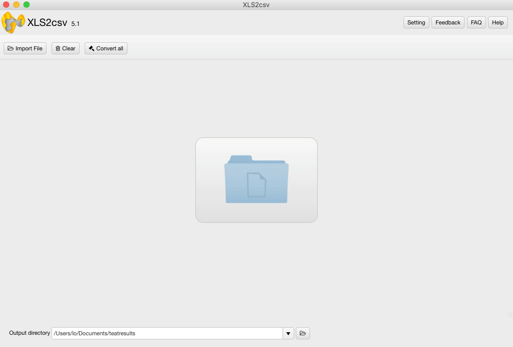

layout: app
title: XLS2csv - convert XLS files to CSV on Mac  
subtitle: XLS2csv
comments: false
current: index
keywords: xls2csv, xlsx to csv converter, xls to csv converter mac, mac xlsx to csv converter, excel to csv converter for mac
description: XLS2csv is an easy-to-use XLS/XLSX to CSV converter for Mac. It helps users to batch convert XLS/XLSX files to CSV format on Mac OS X. 
---

## OVERVIEW

 
**XLS2csv** is a simple and intuitive XLS/XLSX to CSV Converter for Mac. It handles .xls/.xlsx files from Microsoft Excel, Apple Numbers, Open Offices Excel and converts them to .csv text file format on Mac platform. 

This Mac XLS2csv converter app can intelligently recognize large XLS/XLSX files as well as a group of XLS/XLSX files and batch convert them to CSV format quickly. Users are allowed to drag-and-drop a file or directory to the interface of XLS2csv, and preview the loaded Excel spreadsheets before conversion. Plus, you can customize delimiters in the CSV as comma, semicolon, space, tab, etc.

XLS2csv converter fits into any budget and grows with your needs. Try the app now and see how it can make your job easier. Everything you need is contained in one simple installer, no additional downloads or plug-ins are required. We make it simple for you, now and later!

 

<h3>Price: $35.99 
</h3>
 

 

## USE CASES: BUILT FOR YOU
XLS and XLSX are two file extensions that are used by the very popular spreadsheet application from Microsoft named Microsoft Excel. XLS is very popular as it has been the default format for Microsoft Excel since it was first created up till 2003. In the Microsoft Office 2007 release, Microsoft decided to change the default file format to a different format and adding and additional x for all their document extensions; for Excel, this ended up as XLSX.

As we look deeper into the differences between XLS and XLSX, we can see that the way the information is stored is vastly different for both XLS and XLSX formats. XLS is based on BIFF (Binary Interchange File Format) and as such, the information is directly stored to a binary format. On the other hand, XLSX is based on the Office Open XML format, a file format that was derived from XML. The information in an XLSX file is stored in a text file that uses XML to define all its parameters.

As XLSX is stored in a text file format, Microsoft decided to remove macro support for this file format. Instead they assigned a totally different file extension that allows the use of macros; it is named XLSM. The older XLS file extension does not have this issue and it is able to hold spreadsheets that contain macros or not.

A CSV is a comma separated values file which allows data to be saved in a table structured format. CSV files can be used with any spreadsheet program, such as Microsoft Excel, Open Office Calc, or Google Spreadsheets. They differ from other spreadsheet file types in that you can only have a single sheet in a file, they can not save cell, column, or row styling, and can not save formulas. In e-commerce, CSVs are used primarily for importing and exporting product, customer, and order information to and from your store.

CSV files hold plain text as a series of values (cells) separated by commas (,) in a series of lines (rows). You can actually open a CSV file in a text editor and read it yourself. CSV files are intentionally designed to be widely supported; any OS or application that imports or exports data usually has CSV support.  
